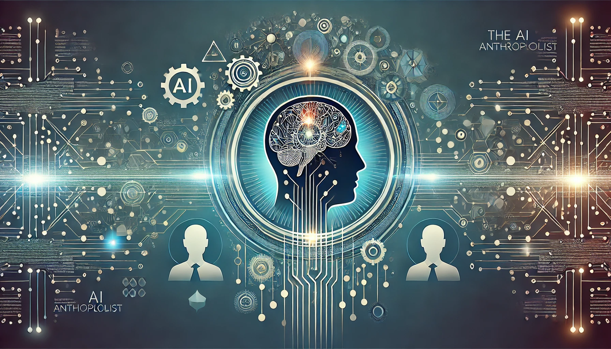

In an era where [Artificial Intelligence (AI)](https://www.ibm.com/cloud/learn/what-is-artificial-intelligence) is transforming every aspect of our lives, the workplace stands as one of the most promising yet underexplored frontiers for AI applications. While AI has made significant strides in automating tasks, enhancing productivity, and streamlining operations, its potential to understand and improve human dynamics within organizations is just beginning to be realized. This series introduces the concept of the **AI Anthropologist**—an innovative application of AI that could revolutionize our understanding of workplace culture, communication patterns, and social dynamics.

<!--more-->

This blog post is the first in a four-part series that will explore the AI Anthropologist concept, its potential benefits, the ethical considerations it raises, and how to implement it thoughtfully in your organization. In this introductory post, we'll dive into the foundational ideas behind the AI Anthropologist, why it's an exciting development for workplace analysis, and how it fits into the broader landscape of AI in the workplace.

### The Emergence of the AI Anthropologist

At its core, the AI Anthropologist concept draws from the discipline of [anthropology](https://www.americananthro.org/AdvanceYourCareer/Content.aspx?ItemNumber=2150), which traditionally involves the study of human societies, cultures, and their development. In a workplace context, anthropology seeks to understand the complex social interactions, cultural norms, and unwritten rules that govern how people work together. These are the subtle dynamics that often go unnoticed but have a profound impact on everything from employee morale to innovation and productivity.

The AI Anthropologist leverages advanced AI technologies—such as [Natural Language Processing (NLP)](https://www.ibm.com/cloud/learn/natural-language-processing), [emotion recognition](https://www.sciencedirect.com/topics/computer-science/emotion-recognition), and [machine learning](https://www.ibm.com/cloud/learn/machine-learning)—to observe and analyze these dynamics in a way that was previously impossible. Imagine an AI system that can map out informal networks within your organization, identify hidden influencers, detect shifts in team morale, and even quantify the often-overlooked "invisible work" that keeps the wheels turning. This AI wouldn't replace human intuition or decision-making; rather, it would augment our understanding of the workplace, providing leaders with data-driven insights into the social fabric of their organizations.

### Why the AI Anthropologist Matters

Workplaces are inherently complex, with layers of social interaction that can be difficult to navigate and even harder to manage. Traditional management approaches often rely on surface-level metrics—productivity rates, employee turnover, and engagement scores—to assess the health of an organization. While these metrics are valuable, they often fail to capture the deeper, more nuanced aspects of workplace culture and dynamics.

The AI Anthropologist addresses this gap by providing a more holistic view of organizational dynamics. By analyzing communication patterns, meeting dynamics, and informal networks, the AI can reveal insights that might otherwise remain hidden. For example:

- It might identify a particular team member who, despite not holding a formal leadership position, is a key influencer in decision-making processes.
- It could uncover that a certain department is consistently overburdened with "invisible work"—tasks that are crucial but often go unrecognized.
- The AI might detect early signs of team burnout or disengagement, allowing for proactive interventions.

Moreover, the AI Anthropologist can track changes in team morale or company culture over time, allowing leaders to intervene before small issues become major problems. This proactive approach could be particularly valuable in today's fast-paced, remote-working environments, where maintaining a strong, cohesive culture is more challenging than ever.

### The Ethical Landscape: Balancing Insight with Privacy

The potential benefits of the AI Anthropologist are significant, but they come with important ethical considerations. The idea of an AI that monitors workplace interactions can easily evoke concerns about privacy and surveillance. No one wants to feel like they're being watched or judged by an algorithm, especially when it comes to something as personal as workplace relationships and culture.

To implement the AI Anthropologist in a way that enhances the workplace without crossing into "Big Brother" territory, it's crucial to establish clear boundaries and ethical guidelines. [Transparency](https://www.shrm.org/resourcesandtools/hr-topics/employee-relations/pages/workplace-transparency-.aspx) is key—employees need to understand what the AI is doing, why it's being used, and how it will benefit them. Moreover, the data collected should be anonymized and used to generate insights at a group or departmental level, rather than focusing on individuals.

In the following posts in this series, we'll explore these ethical considerations in greater detail, providing practical guidance on how to implement the AI Anthropologist in a way that respects privacy and fosters trust.

### Outlining the Series

This post serves as an introduction to the concept of the AI Anthropologist and its potential to transform workplace dynamics. In the subsequent posts, we'll dive deeper into specific aspects of this concept, offering a comprehensive guide to understanding and implementing AI in this novel role.

#### **Post 2: The Technologies Behind the AI Anthropologist**

The second post will explore the technologies that make the AI Anthropologist possible. We'll take a closer look at Natural Language Processing, emotion recognition, and machine learning, examining how these technologies can be used to analyze workplace dynamics. This post will also discuss the limitations of current AI technologies and what advancements are needed to fully realize the potential of the AI Anthropologist.

#### **Post 3: Ethical Considerations and Privacy Concerns**

The third post will focus on the ethical landscape surrounding the AI Anthropologist. We'll delve into the potential privacy concerns and how they can be mitigated through thoughtful implementation. This post will offer practical advice on establishing ethical guidelines, ensuring transparency, and maintaining employee trust. We'll also explore case studies of organizations that have successfully implemented similar AI systems while navigating these challenges.

#### **Post 4: Implementing the AI Anthropologist: A Step-by-Step Guide**

The final post in the series will provide a detailed roadmap for implementing the AI Anthropologist in your organization. We'll cover everything from gaining buy-in from stakeholders to rolling out the AI in stages, ensuring a smooth and ethical integration. This post will also discuss how to measure the success of the AI Anthropologist and iterate on the implementation to continuously improve workplace culture.

### Conclusion

The AI Anthropologist represents a new frontier in understanding and improving workplace dynamics. By providing deeper insights into the social fabric of an organization, it offers leaders a powerful tool to foster a healthier, more productive, and more innovative workplace. However, realizing this potential requires a thoughtful and ethical approach—one that balances the need for insight with the imperative to respect privacy and build trust.

As we move forward in this series, we'll explore the technologies, ethical considerations, and implementation strategies that can help you successfully integrate an AI Anthropologist into your organization. Whether you're a leader looking to enhance your team's dynamics or a tech enthusiast interested in the cutting-edge applications of AI, this series will provide the insights and guidance you need to navigate this exciting new frontier.

Stay tuned for our next post on the technologies powering the AI Anthropologist. If you have any questions or thoughts on how AI could transform workplace dynamics in your organization, feel free to leave a comment below.

### More on Simpleminded Robot

If you found this article interesting, you might also enjoy these related posts:

- [Navigating the Use of AI Tools in Daily Work](): This post explores how to effectively integrate AI tools in the workplace, balancing efficiency with human skills and ethical considerations. It provides valuable insights that complement the AI Anthropologist concept, especially in terms of practical implementation and ethical use of AI in the workplace.

- [Critically Evaluating AI-Generated Content in Software Development](): While this post focuses on software development, the critical thinking skills it discusses are highly relevant to the AI Anthropologist concept. These skills can be applied when evaluating the insights and recommendations provided by an AI Anthropologist system.

- [Enhancing Cybersecurity with AI](): This post discusses the application of AI in cybersecurity, which shares some common ground with the AI Anthropologist concept in terms of using AI to analyze patterns and detect anomalies. It can provide additional context on how AI can be used to protect organizational assets, including sensitive workplace data.

- [Analyzing Media with Custom GPT](): This post explores the use of AI for media analysis, which could be relevant to the AI Anthropologist's potential role in analyzing workplace communication and content.

These posts provide additional perspectives on AI applications in various workplace contexts, which can help readers develop a more comprehensive understanding of how AI, including the AI Anthropologist concept, can be leveraged to improve workplace dynamics and productivity.
