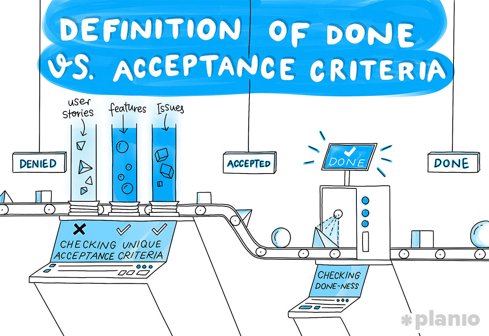

---
categories:
  - agile
  - artificial intelligence
contributors:
  - Scot Campbell
date: 2024-09-20 00:00:00+00:00
description: Explore how AI can enhance the Definition of Done in Agile development,
  improving clarity, testability, and compliance while ensuring consistent quality
  across projects.
draft: false
homepage: false
lastmod: 2024-09-20 00:00:00+00:00
pinned: false
seo:
  canonical: https://sr4001.net.//blog/ai-enhanced-agile-dod/
  description: Explore how AI can enhance the Definition of Done in Agile development,
    improving clarity, testability, and compliance while ensuring consistent quality
    across projects.
  noindex: false
  title: "Enhancing the Definition of Done in Agile Development with AI: Achieving
    Clarity, Testability, and Compliance"
summary: Explore how AI can enhance the Definition of Done in Agile development, improving
  clarity, testability, and compliance while ensuring consistent quality across projects.
tags:
  - AI
  - agile
  - definition of done
  - software development
  - compliance
title: "Enhancing the Definition of Done in Agile Development with AI: Achieving Clarity,
  Testability, and Compliance"
weight: 50
---

In Agile software development, the **Definition of Done (DoD)** is critical for ensuring that teams share a clear understanding of when a task or user story is fully complete. It's not just about checking boxes but ensuring the deliverable meets certain quality standards, is testable, and can be released into production with confidence. A solid DoD serves as a benchmark for delivering high-quality software that aligns with both customer expectations and regulatory requirements. Yet, despite its importance, defining and managing a robust DoD can be challenging.

<!--more-->



This is where Artificial Intelligence (AI) can step in. AI tools can help development teams create clearer, more actionable, and testable Definitions of Done while also ensuring consistency, reducing ambiguity, and enhancing compliance with industry regulations. In this post, we'll explore how AI can elevate the Definition of Done in Agile software development and provide actionable insights on how to implement AI-driven strategies to improve the quality of the development process.

### **1. The Importance of a Strong Definition of Done in Agile Development**

The Definition of Done is more than just a simple checklist—it's the foundation for delivering software that works as intended and meets quality standards. A well-defined DoD provides:

- **Clarity**: It ensures that everyone on the team knows exactly what "done" means.
- **Accountability**: Teams can't claim a story is complete unless all conditions of the DoD are met.
- **Consistency**: A shared DoD across teams reduces misunderstandings and ensures uniform quality across different features or modules.
- **Testability**: A good DoD ensures that all features can be validated through tests (both automated and manual).

However, defining the DoD can be a difficult process. Teams might struggle with writing detailed, unambiguous, and testable criteria, or they might overlook certain aspects of non-functional requirements such as security, performance, or compliance. This is where AI can make a significant difference.

### **2. Using AI to Generate Better Definitions of Done**

AI can be a powerful tool for generating, refining, and optimizing Definitions of Done. By leveraging past data, industry best practices, and the specifics of your project, AI can automate the creation of a comprehensive DoD that is both clear and actionable.

#### **Automated Generation of Definitions of Done**

One of the main ways AI can help is by automating the generation of the DoD. AI tools can analyze patterns in previous user stories, acceptance criteria, and completed projects to suggest optimal criteria for a given task or story. This ensures that the DoD is comprehensive, covering everything from functional to non-functional requirements.

For instance, a simple DoD like "The feature is tested and complete" can be automatically refined by AI into a more detailed DoD:

- Unit tests for the feature have 100% code coverage.
- Integration tests between this feature and dependent modules have passed.
- The feature has been successfully deployed in the staging environment and tested under real-world conditions.
- The feature meets performance benchmarks (e.g., response time under 500 milliseconds).
- Security tests (such as penetration tests) have been performed and passed.

By making the DoD granular and specific, AI ensures that each item on the checklist is verifiable and reduces the risk of misunderstandings about when a feature is truly complete.

#### **Domain-Specific Adjustments**

AI can adapt the DoD based on the domain in which the software is being developed. For example, a financial technology (fintech) project might have stricter security requirements, while an e-commerce project might prioritize performance under heavy traffic. AI can recognize the nuances of different domains and incorporate relevant industry standards and best practices into the DoD.

For example, for a fintech application, AI might automatically include criteria such as:

- All financial transactions are encrypted with AES-256.
- User data complies with GDPR or PCI-DSS regulations.
- The system can handle 1,000 concurrent users without exceeding a 1-second response time.

#### **Breaking Down Complex Requirements**

Complex user stories or features can often lead to vague and overly broad Definitions of Done. AI can help by breaking down complex requirements into specific, granular tasks. For example, a high-level feature like "Implement user authentication" might be broken down into:

- User can register with an email and password.
- Passwords are stored securely using bcrypt encryption.
- User login is protected with multi-factor authentication (MFA).
- Session tokens are encrypted and have a 30-minute expiry.

By providing specific sub-tasks in the DoD, AI ensures that each requirement is actionable and testable, reducing the chance of misinterpretation.

### **3. Making the Definition of Done More Testable with AI**

One of the most significant challenges in Agile development is ensuring that the DoD is **testable**. Testability means that every item on the checklist can be validated through an automated or manual test, ensuring that features work as intended.

#### **Generating Test Cases from the DoD**

AI can assist in making the DoD more testable by generating corresponding test cases. For example, if the DoD specifies that "The user should be able to log in with multi-factor authentication," AI can automatically generate the relevant test scenarios:

- Test that users can log in with a correct username, password, and MFA code.
- Test that login is rejected when an incorrect password is used.
- Test that login is rejected when an incorrect MFA code is entered.
- Test that users are prompted for MFA every time they log in from a new device.

By generating these test cases, AI ensures that every aspect of the DoD can be verified through tests, reducing the risk of incomplete or faulty implementations.

#### **Gherkin Scenarios for Behavior-Driven Development**

AI can also convert parts of the DoD into **Gherkin language** for use in Behavior-Driven Development (BDD). Gherkin is a human-readable, structured language used to define test scenarios in BDD, which can be easily converted into automated tests using frameworks like Cucumber.

For example, consider the following DoD:

- Form submission must include error validation for required fields and data formats.

AI could automatically generate a Gherkin scenario like this:

```text
Scenario: Form Submission Error Validation
  Given I am on the form page
  When I submit the form with invalid email and empty required fields
  Then I should see a validation error for required fields
  And I should see an error for invalid email format
```

By converting the DoD into Gherkin scenarios, AI ensures that acceptance criteria are clearly defined and can be validated through automated testing.

#### **Real-Time Progress Tracking**

AI can also assist with tracking the fulfillment of the DoD in real time. By integrating with project management tools like Jira or Trello, AI can monitor the progress of each task and automatically update the team on whether all the DoD items have been met. This reduces the risk of overlooking any criteria and ensures that nothing is missed before a feature is marked as complete.

### **4. Ensuring Consistency and Reducing Ambiguity in the Definition of Done**

Ambiguity in the DoD can lead to misunderstandings about what constitutes "done." For example, vague statements like "The feature is tested" leave too much room for interpretation. Does it mean unit tests, integration tests, or acceptance tests?

AI can help reduce ambiguity by identifying vague terms in the DoD and suggesting more specific alternatives. For example:

- "Sufficient testing" could be flagged by AI and replaced with "100% code coverage in unit tests."
- "Code review completed" could be replaced with "Code reviewed by at least two peers with no major issues."

By standardizing the language used in the DoD, AI ensures that everyone on the team has the same understanding of what it means for a feature to be complete.

#### **Consistency Across Projects**

AI can also help maintain consistency across different teams or projects. By analyzing existing DoDs, AI can recommend best practices and ensure that similar user stories or features have similar completion criteria. This ensures that quality standards are uniform across the organization, even as different teams work on different aspects of the product.

For example, if one team's DoD for implementing a login feature includes MFA, AI can suggest including MFA in the DoD for other teams working on similar authentication features.

#### **Identifying Missing Requirements**

AI can analyze similar stories or requirements across different projects and suggest missing or overlooked criteria in the DoD. For instance, if previous projects included certain non-functional requirements, such as performance benchmarks or security tests, AI can recommend including those in the current DoD, ensuring nothing critical is left out.

### **5. Tracking and Learning from Past Failures with AI**

One of AI's biggest strengths is its ability to learn from data. By analyzing past project data, AI can identify patterns in where previous stories or features failed and suggest improvements to the DoD based on those insights.

For example, if several past features failed due to poor stress testing, AI could recommend adding stress tests to the DoD for future features. Similarly, if security vulnerabilities were a recurring issue, AI could suggest including security testing as part of the DoD.

This feedback loop ensures that the DoD evolves over time, incorporating lessons learned from past failures to prevent similar issues in the future.

### **6. Enhancing Compliance with Regulations Using AI**

In highly regulated industries such as finance, healthcare, and legal technology, ensuring compliance with regulations is a critical part of the Definition of Done. AI can help ensure that compliance criteria are automatically included in the DoD, reducing the risk of regulatory violations.

#### **Automated Regulation Checking**

AI can cross-check the DoD against industry regulations or internal compliance requirements. For example, AI can ensure that GDPR, HIPAA, or PCI-DSS regulations are incorporated into the DoD for projects involving sensitive user data. This can include everything from encryption standards to data retention policies and auditing requirements.

For example, for a fintech project, AI might automatically add the following criteria to the DoD:

- All transactions must be encrypted with AES-256.
- User data must be encrypted at rest and in transit.
- Audit logs must be maintained for all user transactions for at least seven years.

By automating the inclusion of compliance criteria, AI ensures that development teams don't overlook critical legal or regulatory requirements.

#### **Suggesting Audit Steps**

Regulatory requirements often include the need for detailed auditing and logging. AI can ensure that the DoD includes documentation and logging requirements for auditability. For example, AI might recommend adding criteria such as:

- Ensure that all user actions are logged with timestamps and user IDs.
- Log any changes made to the system configuration.

This ensures that the software not only meets functional requirements but is also auditable and compliant with industry standards.

### **7. Bridging the Gap Between Functional and Non-Functional Requirements**

A well-rounded Definition of Done should cover both **functional requirements** (the features and behaviors the system must have) and **non-functional requirements** (performance, security, scalability, etc.). However, it's easy for teams to focus more on functional requirements while overlooking critical non-functional aspects. AI can help bridge this gap.

#### **Non-Functional Requirements Based on Functional Criteria**

AI can analyze functional requirements and automatically suggest corresponding non-functional criteria. For example, if the DoD specifies that "The system must support 1,000 concurrent users," AI might suggest adding performance benchmarks to the DoD, such as:

- The system must handle 1,000 concurrent users with response times under 500 milliseconds.
- The system must maintain 99.9% uptime during peak traffic hours.

This ensures that non-functional requirements, such as performance, scalability, and security, are included in the DoD and that the feature is fully tested for real-world conditions.

#### **Integrating Security into the DoD**

Security is a critical non-functional requirement, but it's often overlooked when defining the DoD for functional features. AI can help by suggesting security best practices based on the nature of the feature. For example, if the feature involves handling sensitive user data, AI could recommend adding encryption and security testing criteria to the DoD.

For example:

- Ensure that all user passwords are encrypted using bcrypt.
- Perform penetration testing to identify potential security vulnerabilities.
- Implement multi-factor authentication for all user logins.

By incorporating security into the DoD, AI ensures that features are not only functional but also secure.

### **Conclusion: Leveraging AI to Improve the Definition of Done**

The Definition of Done is a critical component of Agile development, ensuring that teams know exactly what it means for a task or feature to be complete. AI offers numerous opportunities to enhance the DoD by:

- Generating clear, comprehensive, and domain-specific criteria.
- Making the DoD more testable through automated test case generation and Gherkin scenarios.
- Reducing ambiguity and ensuring consistency across teams and projects.
- Tracking progress in real-time and learning from past failures.
- Ensuring compliance with industry regulations and incorporating non-functional requirements like security and performance.

By leveraging AI, teams can ensure that the DoD evolves from a simple checklist to a powerful tool for ensuring quality, compliance, and accountability. This not only improves the software development process but also enhances the final product, ensuring that it meets customer expectations, passes regulatory scrutiny, and performs well in real-world conditions.

AI is transforming how software development teams define, manage, and fulfill their Definitions of Done. It's time to embrace these tools and take the quality of your software development to the next level.

### More on Simpleminded Robot

For more insights on how AI can enhance Agile development processes, check out these related posts:

- [Writing User Stories With AI 1: Introduction](): This post is relevant because it introduces the concept of using AI in Agile processes, which aligns with using AI to enhance the Definition of Done. It provides a foundation for understanding how AI can be applied to various aspects of Agile development.

- [Writing User Stories with AI 2: Fine-Tuning Your Prompt](): This article is pertinent as it delves into the specifics of crafting effective AI prompts. The techniques discussed here can be applied to creating precise and detailed Definitions of Done using AI, ensuring that the AI generates relevant and useful DoD criteria.

- [Writing User Stories with AI 3: Beyond User Stories](): This post is relevant because it explores how AI can be used for more than just writing user stories. It likely covers topics that can be directly applied to enhancing the Definition of Done, such as generating acceptance criteria or breaking down complex requirements.

- [Using AI for Retrospective Analysis in Agile](): This article is particularly relevant to the section on "Tracking and Learning from Past Failures with AI" in the current post. It likely provides insights into how AI can analyze past project data to improve future processes, which is directly applicable to refining the Definition of Done over time.

- [Harnessing AI to Tame the Knowledge Chaos in Agile Teams](): This post is relevant because it addresses how AI can help manage and organize information in Agile teams. This concept is crucial for maintaining consistent and clear Definitions of Done across different projects and teams, which is a key point in the current article.
