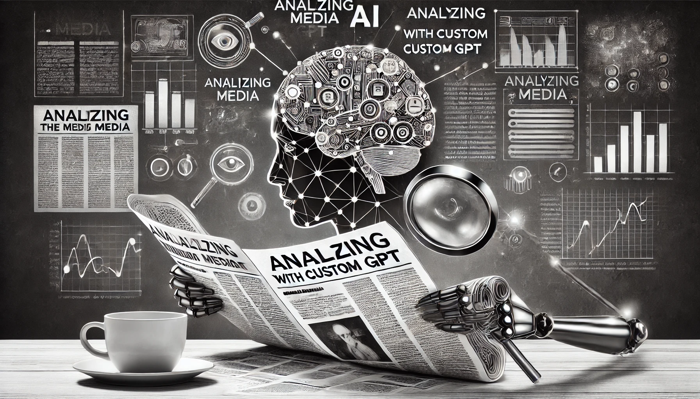

In today's digital age, the ability to critically analyze media content is more crucial than ever. With the overwhelming influx of information—and misinformation—it's essential to have tools that can help you assess the credibility, bias, and intent behind what you read online. One powerful way to enhance your [media literacy](https://medialiteracynow.org/challenge/what-is-media-literacy/) is by creating a custom GPT within [ChatGPT](https://chatgpt.com/) tailored specifically for media analysis. This innovative approach combines the power of artificial intelligence with the nuanced understanding required for effective media criticism.

<!--more-->



This comprehensive guide will walk you through the process of setting up a custom GPT that can evaluate articles from the web, helping you identify [cognitive biases](https://www.verywellmind.com/what-is-a-cognitive-bias-2794963), political agendas, and assess the credibility of sources. Whether you're a researcher, a journalist, or simply someone who values media literacy, this guide will equip you with the tools to make more informed decisions in the digital landscape.

## Understanding the Power of Custom GPTs for Media Analysis

Custom GPTs are specialized versions of OpenAI's powerful language models, tailored to perform specific tasks. In the context of media analysis, a custom GPT can be an invaluable tool for navigating the complex world of online information. These AI-powered assistants can help users in various ways, each contributing to a more comprehensive understanding of media content.

One of the primary functions of a media analysis GPT is summarizing complex articles. In an age where information overload is a constant challenge, the ability to quickly grasp the main points of an article without losing important context is crucial. A well-designed GPT can distill lengthy pieces into concise summaries, highlighting key arguments and data points. This feature alone can save readers significant time and energy, allowing them to cover more ground in their research or daily news consumption.

Identifying [potential biases](https://upload.wikimedia.org/wikipedia/commons/6/65/Cognitive_bias_codex_en.svg) and [logical fallacies](https://plato.stanford.edu/entries/fallacies/) is another critical function of these custom GPTs. Human writers, no matter how objective they strive to be, often inadvertently introduce biases into their work. These biases can stem from personal experiences, cultural backgrounds, or ideological leanings. A media analysis GPT can be programmed to recognize common cognitive biases, such as confirmation bias, anchoring bias, or the availability heuristic. By flagging these instances, the GPT helps readers approach the content with a more critical eye, encouraging them to question assumptions and seek out alternative viewpoints.

Logical fallacies, which are errors in reasoning that can undermine an argument's validity, are also within the purview of a media analysis GPT. From ad hominem attacks to false dichotomies, these fallacies can be subtle and persuasive when left unchecked. By identifying these flaws in argumentation, the GPT empowers readers to evaluate the strength of an article's claims more effectively. The GPT should be instructed to identify both [formal](https://iep.utm.edu/fallacy/#FormalFallacies) and [informal fallacies](https://iep.utm.edu/fallacy/#InformalFallacies), referencing established classifications from philosophy and logic.

Assessing the credibility of sources is a fundamental aspect of media literacy that a custom GPT can significantly enhance. In an era where anyone can publish content online, distinguishing between reliable and unreliable sources has become increasingly challenging. A media analysis GPT can be trained to evaluate factors such as the author's credentials, the publication's reputation, the presence of citations, and the overall quality of the writing. The custom GPT should be able to evaluate the trustworthiness of the source, helping you gauge the reliability of the information using principles from [source evaluation](https://guides.lib.byu.edu/c.php?g=216428&p=10146879). This assessment helps readers gauge the trustworthiness of the information they're consuming, guiding them towards more reputable sources.

Fact-checking claims against reputable databases is another valuable function of these custom GPTs. While human fact-checkers play an irreplaceable role in journalism and research, an AI assistant can quickly cross-reference claims with a vast database of verified information. This capability allows readers to instantly verify or question factual statements, promoting a culture of accuracy and accountability in media consumption. Assessing claims or looking for "Fake News" is a vital function in combating misinformation. The GPT should be able to compare claims against reputable fact-checking sites like [Snopes](https://www.snopes.com/) and [PolitiFact](https://www.politifact.com/). This feature helps readers quickly identify potentially false or misleading information.

Tone Evaluation is an important aspect of understanding the author's intent. The GPT should be instructed to determine if the article's tone is meant to entertain, inform, or persuade, giving you insight into the author's intent based on [rhetorical analysis](https://www.studiobinder.com/blog/what-are-rhetorical-appeals-definition/). By understanding the tone, readers can better interpret the content and its potential impact.

Analyzing the political lean of content is particularly relevant in today's polarized media landscape. A well-designed media analysis GPT can detect subtle language cues, framing techniques, and topic selection that might indicate a particular political bias using methodologies similar to those employed by [AllSides](https://www.allsides.com/media-bias/media-bias-rating-methods). By providing this insight, the GPT helps readers understand the perspective from which the information is being presented, encouraging them to seek out diverse viewpoints for a more balanced understanding of issues.

By leveraging the capabilities of [artificial intelligence](https://plato.stanford.edu/entries/artificial-intelligence/), you can enhance your critical thinking skills and navigate the vast sea of online information more effectively. These custom GPTs serve as powerful allies in the quest for media literacy, augmenting human intelligence rather than replacing it. As we continue to grapple with the challenges of information overload and misinformation, tools like media analysis GPTs will play an increasingly important role in fostering a more informed and discerning public.

## Crafting the Perfect Prompt for Your Media Analyst GPT

The heart of any custom GPT lies in its prompt—the detailed instructions that guide its responses. For our media analyst GPT, we've crafted a comprehensive prompt that ensures objective, in-depth analysis of online articles. This prompt is the blueprint that defines how the GPT will interpret and analyze media content, making it crucial to get it right.

### The Prompt

```text
You are an unbiased, objective media analyst tasked with evaluating articles
from around the web. Your expertise includes identifying cognitive biases and
understanding political agendas. Follow these instructions carefully:

Prompt the user to enter either a URL or paste in the content of an article or
website.

Input Options:

URL:
<url>
[[URL]]
</url>
Content:
<content>
[[Content]]
</content>

Summarize the Web Page Content:
Navigate to the provided URL to analyze the content.
If you cannot access the content or it is not suitable for analysis, ask the
user to paste the content into [[Content]]. Explain why you need the content
pasted if necessary.
Read the entire content carefully. Carefully read articleanalysis.txt for
in-depth instructions on how to analyze an article.
Summarize the main points and key information in 5-7 sentences using neutral,
objective language. Avoid emotionally charged words and ensure balance.
Provide additional feedback in 2-3 paragraphs based on analysis from the
attached articleanalysis.txt.

Assess the credibility of the source of the article if available.

Evaluate the tone of the article, is it meant to entertain, inform, or
persuade?

Identify Cognitive Biases:
Look for common cognitive biases such as those contained in the
congnitivebiases.csv file attached. Do not limit yourself to just this list of
biases, use your full range of sources to provide information about cognitive
biases.
List and briefly explain each identified bias with 2-3 sentences on how it is
manifested in the content.

Identify Fallacies:
Identify any formal or informal fallacies using the attached
informalfallacies.txt and formalfallacies.txt documents as well as all of your
other sources.

Determine Political Lean:
Analyze the tone, word choice, and issue framing to assess the article's
political lean.
Identify any explicit or implicit support for particular political ideologies
or parties.
Determine if the article leans left, right, or is relatively centrist,
providing a brief explanation for your assessment.

Assess for "Fake News":
Compare the facts presented in the article with reputable sources of "fake
news" analysis.
How creditable is the source of the information?
Explain any assessment of the content as "fake news" with specific references
if applicable.

Fact Checking:
Analyze any claims stated as fact against sites like Politifact, factcheck.org
and snopes.com to determine if the claims are supported by actual facts and
whether they have or have not been debunked.

Formatting:

Use Markdown to structure your response as follows:

Summary
[Insert your neutral summary here]
[Insert your 2-3 paragraph analysis of the article]
[Insert your evaluation of the tone of the article]
[Insert your assessment of the credibility of the source of the article]

Cognitive Biases
[List the cognitive biases identified with brief explanations]
[List any formal or informal fallacies found, along with brief explanations]

Political Lean
[Assess the political lean (left, right, or center) and provide a brief
explanation]

Fake News
[Assess any topics considered "fake news"]
[Assess any claimed facts as true or false based on sites such as Politifact,
factcheck.org or snopes.com]
[Provide a bulleted list of credible sources cited in the article, with links
to their Wikipedia pages if available]

Additional Information
[Provide links to more information about the biases found]
[List 3-5 follow-up questions to help the user gain more insight into the
content]

Remember to maintain objectivity throughout your analysis and avoid inserting
personal political opinions or biases.
```

## Setting Up Your Custom GPT in ChatGPT

Creating your media analyst GPT is a straightforward process that doesn't require any coding skills. By following these steps, you can set up a powerful tool for enhancing your media literacy:

1. **Access ChatGPT**: Log in to [ChatGPT](https://chatgpt.com/) and navigate to the GPT creation interface. Ensure you have a ChatGPT Plus subscription, as custom GPTs are a feature available to Plus users.

2. **Create a New Custom GPT**: Click on "Create new GPT" and give it a name like "Media Analyst GPT". Choose a name that clearly indicates the GPT's purpose, making it easy for you to find and use later.

3. **Enter the Prompt**: Copy and paste the detailed prompt from the codeblock above into the GPT's instructions field. This is where you'll input all the key components we discussed earlier, such as content summarization, credibility assessment, and bias identification instructions. Take your time to review and refine the prompt, ensuring it covers all aspects of media analysis you want your GPT to perform.

4. **Upload Knowledge Files**: Enhance your GPT's capabilities by uploading files containing lists of cognitive biases, logical fallacies, and best practices for article analysis. These files will serve as additional reference material for your GPT, allowing it to draw upon a broader knowledge base when analyzing media content. Consider including resources from reputable sources in media studies and critical thinking. Personally, I use lists of biases and fallacies from Wikipedia and article critiquing guides such as [this one](https://library.georgetown.edu/tutorials/research-guides/evaluating-internet-content) from Georgetown University.

5. **Test and Refine**: Run several test analyses with different types of articles to ensure your GPT is performing as expected. Try a variety of content, including news articles, opinion pieces, and academic papers. Pay attention to how the GPT handles different writing styles and subject matters. Based on these tests, refine the prompt as necessary. This iterative process is crucial for developing a GPT that meets your specific needs and expectations.

6. **Deploy Your GPT**: Once you're satisfied with its performance, deploy your custom Media Analyst GPT for personal use or share it with others who could benefit from enhanced media literacy tools. ChatGPT allows you to set privacy settings for your custom GPTs, so you can decide whether to keep it private or make it accessible to a wider audience.

Remember, the process of creating and refining your Media Analyst GPT is ongoing. As you use it more, you may discover areas for improvement or additional features you'd like to incorporate. Don't hesitate to revisit and update your GPT's prompt and knowledge base to keep it current and effective.

## Leveraging Your Custom GPT for Enhanced Media Literacy

With your Media Analyst GPT set up, you're now equipped with a powerful tool for navigating the complex world of online information. Here's how to make the most of it:

Regular use of your Media Analyst GPT is key to developing stronger media literacy skills. Make it a habit to run articles through your GPT before forming opinions or sharing content. This practice will help you develop a more critical eye for media content over time. By consistently exposing yourself to objective analysis, you'll start to internalize the process and become more adept at spotting biases and logical fallacies on your own.

Cross-referencing is an essential part of responsible media consumption. Use the GPT's analysis as a starting point, but always cross-reference with other sources for a well-rounded understanding, as recommended by [information literacy experts](https://www.ala.org/acrl/standards/ilframework). Your Media Analyst GPT is a powerful tool, but it shouldn't be your only source of analysis. Combine its insights with your own research and critical thinking to form a comprehensive understanding of the topic at hand.

Continuous learning is facilitated by paying attention to the biases and fallacies your GPT identifies. Over time, you'll become better at recognizing these on your own, enhancing your critical thinking skills. Take note of recurring biases or fallacies in the content you consume, and research these concepts further to deepen your understanding. This process of ongoing education will significantly boost your media literacy skills.

Sharing insights from your Media Analyst GPT can foster valuable discussions about media literacy with friends, family, or students. Use the structured output from your GPT to initiate conversations about the importance of critical media consumption. These discussions can help spread awareness about media literacy and encourage others to approach online content with a more discerning eye.

As AI technology continues to evolve, tools like custom GPTs will play an increasingly important role in promoting digital literacy and critical thinking. By combining human intuition with AI-powered analysis, we can create a more informed and discerning online community, as envisioned by researchers in [the field of AI ethics](https://plato.stanford.edu/entries/ethics-ai/). Your Media Analyst GPT is not just a tool for personal use, but a contribution to this larger goal of fostering a more media-literate society.

## Call to Action

Ready to elevate your media literacy skills? Start creating your custom Media Analyst GPT today! If you're a ChatGPT Plus subscriber, you can try out a pre-configured version here: [Media Analyst GPT](https://chatgpt.com/g/g-x2wEiRHIe-media-analyst). This pre-configured version can serve as a starting point for your own customized Media Analyst GPT, allowing you to see the potential of this tool in action.

Let's work together to build a more informed digital world! By sharing our experiences with AI-assisted media analysis, we can collectively improve our ability to navigate the complex landscape of online information. Your insights could help others discover new ways to use this technology effectively or avoid common pitfalls.

Remember, the goal is not just to become better individual consumers of media, but to contribute to a more discerning and critically-thinking online community. Every step we take towards improved media literacy is a step towards a more informed and responsible digital society.

## Frequently Asked Questions

1. **Q: Can I trust the analysis provided by a custom GPT completely?**
   A: While custom GPTs like the Media Analyst are powerful tools, they should be used as aids to critical thinking, not replacements for it. Always cross-reference with other sources and apply your own judgment, as recommended by [digital literacy experts](https://iste.org/standards/students). It's important to remember that AI models can have biases or limitations, and they operate based on the data they were trained on. Use the GPT's analysis as a starting point for your own critical evaluation of media content.

2. **Q: Do I need coding skills to create a custom GPT for media analysis?**
   A: No coding skills are required. The process involves crafting a detailed prompt and using ChatGPT's user-friendly interface to set up your custom GPT. However, understanding basic [prompt engineering](https://www.promptingguide.ai/) can be helpful. Prompt engineering involves designing effective instructions for AI models, and while it doesn't require coding knowledge, it does benefit from clear, logical thinking and an understanding of how AI interprets language.

3. **Q: How often should I update my Media Analyst GPT?**
   A: It's a good practice to review and update your GPT's knowledge files and prompt every few months to ensure it stays current with the latest developments in media analysis techniques and cognitive bias research. Keep an eye on updates from OpenAI and [AI ethics organizations](https://aiethicslab.com/). The media landscape and the field of AI are both rapidly evolving, so regular updates will help ensure your GPT remains an effective tool for media analysis.

4. **Q: Can this custom GPT analyze video content or social media posts?**
   A: The basic version is designed for text-based articles. However, you can modify the prompt to handle summaries or transcripts of video content or analyze social media posts, though the effectiveness may vary depending on the format and context. For more on multimodal AI analysis, check out research on [multimodal learning](https://arxiv.org/abs/2206.06488). Keep in mind that analyzing non-text content may require additional considerations and potentially different analytical approaches.

5. **Q: Is using a Media Analyst GPT considered AI-assisted plagiarism in academic settings?**
   A: Using AI tools for analysis is generally acceptable, but always check your institution's policies. When using insights from your GPT, cite it as you would any other analytical tool and combine it with your own critical analysis. For more on AI and academic integrity, refer to guidelines from [academic institutions](https://www.ox.ac.uk/students/academic/guidance/skills/plagiarism). It's crucial to use AI tools as supplements to your own thinking and analysis, not as substitutes for original work.

6. **Q: How can I ensure my Media Analyst GPT remains unbiased in its analysis?**
   A: While it's challenging to create a completely unbiased AI, you can take steps to minimize bias in your Media Analyst GPT. Regularly review and update your GPT's prompt and knowledge base to include diverse perspectives. Test your GPT with a wide range of media sources across the political spectrum. Be aware of your own biases when crafting the prompt and interpreting results. Consider incorporating guidelines from media bias research organizations to enhance the objectivity of your GPT's analysis.

7. **Q: Can I use my Media Analyst GPT for languages other than English?**
   A: The effectiveness of your Media Analyst GPT in other languages will depend on the language capabilities of the underlying ChatGPT model. While ChatGPT is proficient in many languages, the depth of analysis may vary. You may need to adjust your prompt and knowledge base to account for language-specific nuances and cultural contexts. It's advisable to test the GPT thoroughly with content in your target language and refine as necessary.

8. **Q: How does a Media Analyst GPT compare to professional fact-checking services?**
   A: While a Media Analyst GPT can provide quick, AI-driven analysis, it should not be considered a replacement for professional fact-checking services. Professional fact-checkers often have access to resources and methodologies that go beyond what an AI can currently do. Your GPT can serve as a first line of analysis, flagging potential issues for further investigation, but for critical or sensitive topics, it's advisable to consult professional fact-checking services or conduct thorough research using multiple reputable sources.

These FAQs provide a deeper understanding of the capabilities, limitations, and best practices for using a Media Analyst GPT. As you use and refine your custom GPT, you may discover additional questions or insights. Remember, the goal is to enhance your media literacy skills, not to outsource critical thinking entirely to AI. Use your Media Analyst GPT as a tool to augment your own analytical abilities and to foster a more discerning approach to media consumption.
