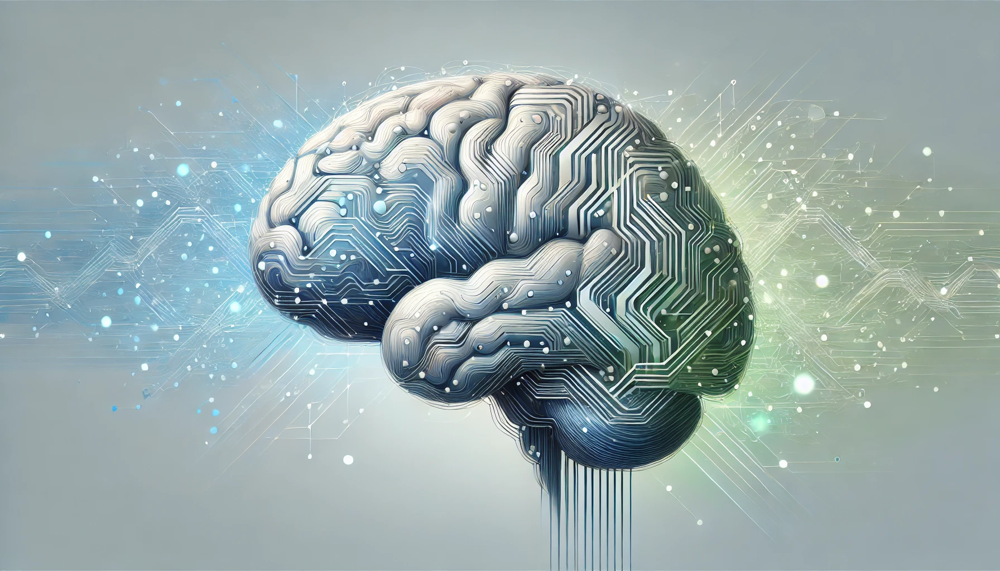

---
categories:
  - artificial intelligence
contributors:
  - Scot Campbell
date: 2024-09-25 00:00:00+00:00
description: Explore the world of emotional intelligence in AI, its capabilities,
  limitations, and the ethical considerations of machines that can recognize and respond
  to human emotions.
draft: false
homepage: false
lastmod: 2024-10-04 20:34:30.287000+00:00
pinned: false
seo:
  canonical: https://sr4001.net.//blog/emotional-intelligence-in-ai/
  description: Explore the world of emotional intelligence in AI, its capabilities,
    limitations, and the ethical considerations of machines that can recognize and
    respond to human emotions.
  noindex: false
  title: "Emotional Intelligence in AI: Can Machines Understand Feelings?"
summary: "Explore the world of emotional intelligence in AI, its capabilities,
  limitations, and the ethical considerations of machines that can recognize and
  respond to human emotions."
tags:
  - AI
  - emotional intelligence
  - machine learning
  - ethics
categories:
  - artificial intelligence
  - emotional intelligence
title: "Emotional Intelligence in AI: Can Machines Understand Feelings?"
weight: 50
---

Artificial intelligence (AI) has been advancing at an incredible pace, transforming the way we live, work, and interact with technology. As AI becomes more integrated into our daily lives, a fascinating and complex question arises: Can machines understand human emotions? Emotional intelligence, once thought to be a uniquely human trait, is now being explored in AI development. This exploration not only challenges our understanding of intelligence but also raises important ethical and philosophical questions. In this article, we'll dive deep into what emotional intelligence is, how AI currently interacts with emotions, the challenges and potential advancements in this field, and the ethical and philosophical considerations that come with trying to teach machines about feelings.

<!--more-->

## What Is Emotional Intelligence?

Emotional intelligence (EI) is all about the ability to recognize, understand, manage, and influence emotions—both our own and those of others. Psychologist Daniel Goleman popularized the concept in the 1990s, breaking it down into five key components: self-awareness, self-regulation, motivation, empathy, and social skills. These elements are interrelated and together enable individuals to navigate social complexities, make informed decisions, and build strong relationships.

### Self-Awareness

Self-awareness means being in tune with your own emotions. It's about understanding how your feelings affect your thoughts, behaviors, and interactions with others. For example, if you're feeling frustrated during a meeting, recognizing that emotion can help you address it constructively instead of reacting impulsively. By acknowledging your frustration, you might take a moment to breathe, reflect on what's causing it, and choose a response that contributes positively to the discussion. This level of introspection not only helps in managing your own emotions but also influences how others perceive and respond to you.

### Self-Regulation

Once you're aware of your emotions, self-regulation is about managing them effectively. It's the ability to stay calm under pressure, control impulsive behaviors, and respond thoughtfully rather than reactively. This skill is crucial in stressful situations, helping you make better decisions and maintain professional relationships. For instance, if you receive critical feedback, instead of becoming defensive or upset, self-regulation allows you to process the information objectively, recognize any valuable insights, and use it as an opportunity for growth. By managing your emotional responses, you can navigate challenges more effectively and maintain a sense of balance.

### Motivation

Motivation in the context of emotional intelligence refers to the inner drive that comes from personal passion and a sense of purpose, not just external rewards like money or recognition. It's what keeps you pushing toward your goals, even when obstacles arise. Motivated individuals tend to be more resilient, optimistic, and committed to their objectives. For example, an entrepreneur might face numerous setbacks when launching a new business but remains driven by a passion for innovation and a belief in their vision. This intrinsic motivation fuels persistence and creativity, leading to greater chances of success.

### Empathy

Empathy is the ability to understand and share the feelings of others. It involves picking up on emotional cues, listening attentively, and responding appropriately, which is essential for building strong relationships and fostering collaboration. Empathetic individuals can connect with others on a deeper level, appreciate different perspectives, and provide support when needed. In a team setting, for example, showing empathy towards a colleague who is overwhelmed can help build trust and encourage open communication, ultimately enhancing team cohesion and productivity.

### Social Skills

Good social skills help you interact effectively with others, navigate social situations, and build lasting relationships. This includes clear communication, effective conflict resolution, leadership abilities, and the capacity to build rapport. These skills are important in both personal and professional settings, as they enable you to influence others positively, work collaboratively, and manage relationships constructively. For instance, a manager with strong social skills can motivate their team, resolve disputes amicably, and create an environment where everyone feels valued and heard.

In people, these elements work together in complex and dynamic ways, influenced by biology, personal experiences, culture, and social context. This complexity makes emotions hard to model or quantify, especially for AI systems that rely on data and algorithms. Understanding the subtleties and nuances of human emotions is a significant challenge, but it's also what makes the exploration of emotional intelligence in AI so intriguing.

## How AI Interacts with Emotions Today

AI has come a long way in tasks like pattern recognition, natural language processing, and data analysis. When it comes to emotions, AI mainly focuses on recognizing emotional cues rather than truly understanding or feeling emotions. The current landscape of emotional AI involves technologies designed to detect and interpret human emotions based on observable signals, such as facial expressions, voice tone, and textual sentiment.

### Emotion Recognition Technologies

AI uses several methods to detect and interpret human emotions based on observable signals:

#### Sentiment Analysis

Sentiment analysis is a technique that analyzes text to determine the emotional tone behind the words. It's widely used to gauge public opinion on social media platforms, customer reviews, and feedback forms. For instance, companies might analyze tweets or product reviews to see how people feel about a new product or service. By examining the language used—looking for positive, negative, or neutral words and phrases—AI can provide insights into consumer attitudes and preferences. This information helps businesses make data-driven decisions about marketing strategies, product development, and customer engagement.

#### Facial Expression Recognition

By analyzing facial movements and expressions, AI can identify emotions like happiness, sadness, anger, surprise, fear, and disgust. This technology uses computer vision and machine learning algorithms to detect key facial landmarks and interpret micro-expressions that may not be easily noticeable to the human eye. Facial expression recognition is used in areas like market research, where companies study consumers' reactions to advertisements or products, and even in security settings to assess potential threats based on emotional cues. In customer service, virtual agents might use this technology to gauge a customer's satisfaction during a video call.

#### Voice Tone Analysis

AI examines vocal attributes such as pitch, tone, tempo, and speech patterns to infer someone's emotional state. This is especially useful in customer service environments, where detecting frustration or dissatisfaction in a caller's voice can help companies improve the customer experience. For example, if an AI system identifies that a customer sounds upset, it can route the call to a specialized human representative or offer tailored solutions to address the issue. Voice tone analysis also has applications in healthcare, where it can help monitor patients' emotional well-being through changes in their speech patterns.

### Machine Learning and Deep Learning

These technologies have significantly improved AI's ability to recognize emotional cues by learning from large datasets. Deep learning models, such as neural networks, can identify complex patterns in data, enhancing the accuracy of emotion recognition. For example, convolutional neural networks (CNNs) are effective in image recognition tasks, making them suitable for analyzing facial expressions, while recurrent neural networks (RNNs) are used for processing sequential data like speech and text. By training these models on diverse and extensive datasets, AI systems can improve their ability to detect subtle emotional signals and adapt to different contexts.

Despite these advancements, AI's interaction with emotions is still pretty surface-level. Machines can detect and respond to emotional signals but don't genuinely understand or feel emotions like we do. Their "understanding" is based on pattern recognition and statistical correlations, not on conscious experience or empathy. This limitation highlights the challenges in developing AI that can truly comprehend human emotions.

## The Limitations of AI in Understanding Emotions

While AI can pick up on emotional cues and even mimic emotional responses, several factors prevent it from truly understanding feelings in the way humans do.

### Lack of Consciousness

AI doesn't have consciousness or subjective experiences. It processes inputs and generates outputs based on programming and learned data patterns but doesn't feel emotions. Without consciousness, a machine can't experience joy, sadness, or empathy. This fundamental difference means that AI can only simulate understanding of emotions based on observed behaviors, without any internal emotional experience. For example, a robot might recognize that someone is smiling and interpret that as happiness, but it doesn't share in that emotion or understand the underlying feelings that led to it.

### Simulation vs. Understanding

AI can simulate empathetic responses, but that's not the same as genuinely understanding emotions. For instance, a chatbot might provide comforting words when you express sadness, but it's not actually comprehending your feelings—it's following a script or pattern it has learned from data. This distinction is important because genuine empathy involves not just recognizing someone else's emotional state but also sharing in that experience and responding appropriately based on that shared understanding. AI lacks the subjective experience required for true empathy, limiting its ability to fully engage with human emotions.

### Cultural and Contextual Nuances

Emotions are expressed differently across cultures, social contexts, and individual personalities. An AI trained on specific data might misinterpret emotions in diverse settings, leading to misunderstandings. For example, gestures or expressions that indicate friendliness in one culture might be considered disrespectful in another. Capturing the full range of human emotional expression is a significant challenge, as it requires extensive and diverse datasets, as well as the ability to understand context and adapt to different cultural norms. Without this, AI systems risk making incorrect assumptions about people's emotional states.

### The Complexity of Human Emotions

Human emotions are rarely straightforward. We often experience mixed feelings or hide our true emotions. Sarcasm, humor, irony, and subtext add layers of complexity that AI struggles to grasp. For example, detecting sarcasm in text requires understanding not just the literal words but also the context, tone, and sometimes shared cultural references. Similarly, people might mask their true feelings due to social expectations or personal reasons, making it difficult for AI to accurately interpret their emotional state based solely on observable cues. This complexity underscores the limitations of AI in fully understanding the depth and nuances of human emotions.

## Moving Toward Emotional AI

Despite these challenges, researchers are working on ways to enhance AI's emotional capabilities. By combining insights from various disciplines and focusing on user-centric design, advancements aim to create more empathetic and emotionally responsive AI systems.

### Affective Computing

Affective computing is a field that aims to develop systems capable of recognizing, interpreting, and simulating human emotions. It combines insights from psychology, computer science, and cognitive science to make human-computer interactions more natural and engaging. Researchers in this field work on improving emotion detection algorithms, creating models that can predict emotional responses, and developing AI that can adapt its behavior based on the user's emotional state. For example, an AI personal assistant might detect that you're feeling stressed and adjust its responses to be more supportive or offer to schedule a break in your calendar.

### Integrating Emotional Data

By incorporating emotional data into AI models, machines can offer more personalized experiences. For instance, AI tutors could adjust their teaching methods based on a student's emotional state, potentially improving learning outcomes. If the AI detects that a student is frustrated with a particular topic, it might provide additional explanations, switch to a different teaching approach, or offer encouragement. Similarly, in customer service, AI systems can use emotional data to tailor interactions, making them more effective and satisfying for the user. Integrating emotional data requires careful consideration of privacy and ethical concerns, but it can significantly enhance the user experience.

### Empathetic AI Applications

**Customer Service**: AI agents that detect frustration can adjust their responses or escalate the issue to a human representative. For example, if a virtual assistant notices that a customer is becoming increasingly agitated, it might offer a direct line to customer support or prioritize their query for faster resolution. This not only improves customer satisfaction but also helps companies manage resources more efficiently.

**Healthcare**: Emotional AI can monitor patients' moods, assisting in mental health assessments and interventions. For instance, AI-powered apps can track changes in speech patterns, activity levels, or social interactions to identify signs of depression or anxiety. By providing early detection, these tools can prompt timely support from healthcare professionals.

**Robotics**: Social robots with emotional intelligence can provide companionship and support, especially for the elderly or those with special needs. These robots can engage in conversations, recognize emotional cues, and respond appropriately, helping to alleviate loneliness and improve quality of life. In therapeutic settings, emotionally intelligent robots can assist in treatments for conditions like autism, where consistent and responsive interaction is beneficial.

## Ethical Considerations

Developing emotionally intelligent AI raises important ethical questions that need to be carefully considered.

### Privacy Concerns

Emotion detection often requires sensitive data like facial expressions, voice recordings, and physiological signals. Collecting and processing this information poses privacy risks, as it involves personal and sometimes intimate aspects of individuals' lives. Safeguards are needed to protect personal data, ensure informed consent, and prevent misuse. Organizations developing emotional AI must adhere to strict data protection regulations and be transparent about how they collect, store, and use emotional data.

### Potential for Misuse

Emotionally intelligent AI could be used for manipulation, such as targeting ads when someone is feeling vulnerable or influencing decisions without the person's awareness. There's also the risk of surveillance systems monitoring people's emotional states without consent, infringing on personal freedoms. To prevent misuse, it's essential to establish ethical guidelines, regulatory frameworks, and oversight mechanisms that govern how emotional AI can be developed and deployed.

### Impact on Human Relationships

Relying too much on AI for emotional support might reduce human-to-human interactions, affecting social skills and relationships. While AI can provide convenience and accessibility, it's important to balance technology use with real human connections. Overdependence on AI companions could lead to isolation or hinder the development of empathy and social skills, especially in younger individuals. Encouraging a healthy relationship with technology involves promoting awareness of its limitations and fostering environments that value genuine human interaction.

### Bias and Fairness

AI systems can inherit biases from the data they're trained on. In emotion recognition, this could lead to misinterpretations that disproportionately affect certain groups, such as misreading the emotions of people from different cultural backgrounds or with diverse expressions. Ensuring fairness requires careful dataset selection, algorithm design, and ongoing evaluation to identify and mitigate biases. Inclusivity and diversity in AI development teams can also help address these issues.

## Philosophical Questions

Exploring emotional intelligence in AI brings up deep philosophical debates that challenge our understanding of consciousness, intelligence, and the human experience.

### What Is Consciousness?

Consciousness involves subjective experience—something AI currently lacks. Without it, can machines truly understand or feel emotions? This question challenges our understanding of both consciousness and AI. Some philosophers and scientists argue that consciousness arises from complex neural processes, suggesting that sufficiently advanced AI might one day achieve a form of consciousness. Others believe that consciousness is inherently tied to biological organisms and cannot be replicated in machines. This debate has significant implications for the future of AI and how we perceive its capabilities.

### The Chinese Room Argument

Philosopher John Searle's thought experiment, known as the Chinese Room argument, suggests that a system could appear to understand language (or emotions) without actually understanding anything. In the scenario, a person inside a room follows instructions to manipulate Chinese symbols without knowing Chinese. To an outside observer, it seems as though the person understands the language, but in reality, they're just following rules. This implies that AI might simulate understanding without genuine comprehension, raising questions about the nature of intelligence and whether functional behavior is sufficient for understanding.

### Redefining Intelligence

As AI develops, we might need to rethink what intelligence means. Is it just about logical reasoning and problem-solving, or does it include emotional and social dimensions? This could influence how we approach AI development and assess its progress. If intelligence encompasses emotional understanding and subjective experience, current AI falls short. However, if we define intelligence based on observable behavior and problem-solving abilities, AI systems may already exhibit certain intelligent traits. This redefinition impacts not only AI research but also our perception of human intelligence and the qualities we value.

## Looking Ahead

AI's role in emotional contexts is likely to grow, offering both opportunities and challenges. The future may see AI becoming more integrated into various aspects of our lives, assisting with emotional well-being, communication, and decision-making.

### Enhancing Human Emotional Intelligence

AI tools could help people improve their emotional skills by providing feedback and training in recognizing and managing emotions. For example, apps that analyze speech patterns or facial expressions could offer insights into how you come across in social situations, helping you adjust and improve your interactions. In educational settings, AI could support social-emotional learning by providing personalized guidance and resources.

### Integrating AI into Emotional Life

In the future, AI might become more integrated into our emotional lives, assisting with conflict resolution, mental health support, and personalized communication. Virtual therapists could provide accessible mental health services, using AI to tailor interventions to individual needs. AI-powered communication tools might help mediate misunderstandings by analyzing emotional content and suggesting clarifications. While these applications offer benefits, they also require careful consideration of ethical implications and the importance of maintaining genuine human connections.

### Preparing for Change

We need to proactively address the ethical and social implications of emotionally intelligent AI. This includes developing policies and regulations that protect privacy and prevent misuse, fostering interdisciplinary collaboration among technologists, ethicists, psychologists, and sociologists, and engaging the public in discussions about AI's role in society. By involving diverse perspectives, we can ensure that AI development aligns with shared values and promotes the well-being of all members of society.

## Conclusion

The journey to develop emotionally intelligent AI is both exciting and complex. While machines can recognize and respond to emotional cues, they don't truly understand feelings due to the lack of consciousness and subjective experience. As technology advances, we must carefully navigate the ethical considerations and philosophical questions that arise. If approached thoughtfully and responsibly, integrating emotional intelligence into AI has the potential to enhance human experiences, improve services, and foster innovation without compromising what makes us uniquely human. Balancing technological progress with ethical responsibility will be key to ensuring that emotionally intelligent AI benefits society as a whole.

---

_Note: This article reflects the state of AI and emotional intelligence as of September 25, 2024. Ongoing research may lead to new developments beyond this scope._

## More on Simpleminded Robot

For more insights on AI and its impact on various aspects of our lives, check out these related posts:

- [Enhancing Cybersecurity with AI](): Explore how AI is being used to improve cybersecurity measures, which is crucial as emotionally intelligent AI systems handle more sensitive data.

- [Critically Evaluating Generated Content](): This post discusses how to evaluate AI-generated content, which is relevant when considering the outputs of emotionally intelligent AI systems.

- [AI: Artificial But Not So Intelligent](): This article provides a critical look at the current state of AI, which can offer valuable context for understanding the limitations of emotional AI.

- [Using AI for Retrospective Analysis in Agile](): While focused on agile development, this post shows how AI can be used to analyze human interactions and feedback, which is relevant to the development of emotionally intelligent AI.
