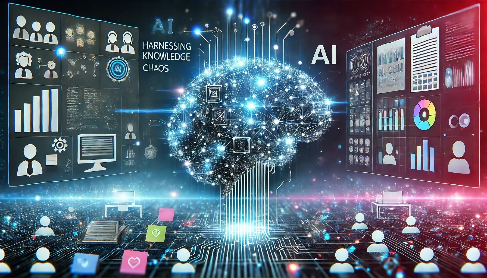

---
categories:
  - agile development
  - artificial intelligence
contributors:
  - Scot Campbell
date: 2024-07-19 00:00:00+00:00
description: Explore how AI transforms knowledge management in Agile teams, enhancing
  collaboration and decision-making for improved project outcomes.
draft: false
homepage: false
lastmod: 2024-07-19 00:00:00+00:00
pinned: false
seo:
  canonical: https://sr4001.net.//blog/harnessing-ai-tame-knowledge-chaos-agile-teams/
  description: Explore how AI transforms knowledge management in Agile teams, enhancing
    collaboration and decision-making for improved project outcomes.
  noindex: false
  title: "AI-Powered Knowledge Management: Revolutionizing Agile Teams"
summary: Explore how AI transforms knowledge management in Agile teams, enhancing
  collaboration and decision-making for improved project outcomes.
tags:
  - agile
  - AI
  - collaboration
  - knowledge management
  - productivity
  - team collaboration
  - human-AI collaboration
title: "AI-Powered Knowledge Management: Revolutionizing Agile Teams"
weight: 50
---

Imagine this scenario: You're deep into an Agile project, racing towards your next milestone. Amidst the flurry of sticky notes, [stand-up meetings](https://www.scrum.org/resources/what-is-scrum), and code reviews, a crucial question arises: "Didn't we tackle a similar challenge last month?" The memory of a discussion lingers, but the specifics are hazy, and documentation is nowhere to be found. This situation is common in many Agile teams.

<!--more-->

Agile teams excel at adapting to change and delivering results swiftly. However, managing the vast knowledge generated along the way can be challenging. [Artificial Intelligence (AI)](https://en.wikipedia.org/wiki/Artificial_intelligence) is emerging as a potential solution to manage information overload and preserve valuable insights in Agile environments.



## The Knowledge Management Challenge in Agile Environments

Agile methodologies prioritize flexibility and speed, which can pose significant challenges for [knowledge management](https://km-world.com). When racing to meet [sprint](https://www.scrum.org/resources/what-is-scrum) deadlines, meticulously documenting information often takes a backseat. As a result, critical insights – such as the rationale behind design choices or lessons learned from complex bugs – can be lost.

Furthermore, knowledge tends to become siloed within teams. While one team might devise an innovative solution, others remain unaware. As organizations grow and team members change, this fragmented knowledge becomes an even more pressing issue.

### The Impact of Knowledge Loss

Poor knowledge management in Agile environments can lead to several issues:

1. **Reduced Productivity**: Teams may waste time reinventing solutions to problems that have already been solved.
2. **Inconsistent Decision-Making**: Without access to past rationales, teams may make inconsistent decisions across projects.
3. **Onboarding Challenges**: New team members may struggle to get up to speed, lacking access to the collective wisdom of the team.
4. **Missed Opportunities**: Innovative ideas that could benefit multiple projects may remain isolated within specific teams.

## AI in Agile Knowledge Management

AI offers tools that can help Agile teams manage their knowledge more effectively. These AI-powered solutions aim to automate aspects of capturing, organizing, and retrieving information.

### 1. AI-Enhanced Meeting Documentation

AI-powered documentation tools can transcribe discussions in real-time and integrate with project management tools, attaching meeting notes to relevant tasks. Tools like [Otter.ai](https://otter.ai) and [Fireflies](https://fireflies.ai) offer these capabilities.

Potential benefits include:

- Comprehensive coverage of meeting details
- Allowing team members to focus on the discussion rather than note-taking
- Creating searchable archives of meeting transcripts
- Identifying and highlighting action items

### 2. Intelligent Information Retrieval Systems

AI-powered search tools aim to go beyond simple keyword matching. They attempt to comprehend context and intent, potentially making it easier to retrieve specific information from past projects or discussions.

Features of these systems may include:

- Semantic search capabilities
- Contextual recommendations of related documents
- Natural language processing for plain language queries
- Learning capabilities to improve search results over time

### 3. Contextual Content Recommendations

Some AI systems can proactively recommend relevant content based on a user's current work. This could help teams leverage their collective knowledge without extensive searching.

Potential advantages include:

- Surfacing relevant information without explicit searches
- Facilitating cross-project learning
- Alerting teams to existing solutions, potentially reducing redundant work
- Enhancing collaboration across different teams and departments

### 4. Automated Knowledge Base Creation and Maintenance

AI can assist in creating and maintaining knowledge bases by automatically categorizing and tagging information from various sources such as project documentation, code repositories, and team communications.

Potential benefits include:

- Keeping the knowledge base current with less manual intervention
- Organizing information in ways that make sense for the team
- Identifying patterns and trends across projects
- Customizing information presentation based on user roles and preferences

## Implementing AI in Agile Knowledge Management

Implementing AI in knowledge management requires careful consideration. While some teams have reported success, others have faced challenges with adoption and integration.

## Considerations for AI in Agile Knowledge Management

When considering AI for knowledge management, teams should keep in mind:

1. **Integration**: Ensure AI tools integrate well with existing platforms to avoid disrupting established workflows.

2. **Training**: Invest time in training team members on effectively using new AI tools.

3. **Continuous Assessment**: Regularly evaluate how AI tools are performing and be prepared to adjust as needed.

4. **Balance**: While AI can enhance knowledge management, human expertise remains crucial. Encourage team members to validate and contextualize AI-generated insights.

5. **Ethics and Privacy**: Implement clear policies on data privacy and usage. Ensure that AI systems respect confidentiality.

6. **Customization**: Consider tailoring AI systems to understand and support specific Agile methodologies.

7. **Impact Measurement**: Regularly assess the impact of AI systems on team productivity and knowledge sharing.

## Challenges in AI-Powered Knowledge Management

While AI offers promising solutions for knowledge management in Agile environments, it's crucial to understand and address the challenges that come with its implementation. These challenges are not insurmountable, but they require careful consideration and planning.

### 1. Data Quality and Consistency

AI systems are only as good as the data they're trained on. In Agile environments, where information is constantly evolving, maintaining high-quality, consistent data can be challenging. Inconsistent terminology, outdated information, or poorly structured data can lead to inaccurate AI outputs.

**Current State**: Many organizations are implementing data governance frameworks and employing data cleaning techniques to improve data quality. Some AI systems now include built-in data quality assessment tools, but these are still in early stages of development.

### 2. Integration with Existing Systems

Agile teams often use a variety of tools for project management, communication, and documentation. Integrating AI knowledge management systems with these existing tools can be complex and time-consuming.

**Current State**: API-first design and microservices architecture are making integration easier, but seamless integration across all tools remains a challenge. Some vendors are developing AI systems specifically designed to work with popular Agile tools, but comprehensive solutions are still evolving.

### 3. User Adoption and Change Management

Introducing AI tools can significantly change how teams work. Some team members may resist these changes, either due to skepticism about AI's capabilities or concerns about job security.

**Current State**: Organizations are focusing on change management strategies, including comprehensive training programs and gradual rollouts. Some AI tools now include user-friendly interfaces and "explainable AI" features to increase transparency and build trust.

### 4. Overreliance on AI

As AI systems become more sophisticated, there's a risk that teams might over-rely on them, potentially stifling critical thinking and creativity.

**Current State**: This is an ongoing challenge. Some organizations are implementing policies that require human validation of critical AI-generated insights. AI tools are also being designed to prompt user input and encourage critical thinking rather than simply providing answers.

### 5. Privacy and Security Concerns

AI systems often require access to vast amounts of organizational data, which can raise privacy and security concerns. This is particularly challenging in industries with strict data protection regulations.

**Current State**: AI vendors are increasingly focusing on privacy-preserving AI techniques, such as federated learning and differential privacy. However, balancing the need for data access with privacy concerns remains a significant challenge.

### 6. Handling Unstructured Data

Much of the knowledge in Agile teams is unstructured – contained in emails, chat messages, or even informal conversations. Capturing and making sense of this unstructured data is a significant challenge for AI systems.

**Current State**: Natural Language Processing (NLP) techniques are improving rapidly, allowing AI to better understand and categorize unstructured data. However, capturing informal knowledge exchanges remains a challenge.

## Current State of the Art in AI-Powered Knowledge Management

Despite these challenges, the field of AI-powered knowledge management is advancing rapidly. Here are some of the current state-of-the-art developments:

### 1. Advanced Natural Language Processing

The latest NLP models, such as GPT-3 and its successors, demonstrate remarkable ability to understand and generate human-like text. This is enabling more sophisticated document summarization, question-answering systems, and even automated documentation generation.

### 2. Knowledge Graphs

AI-powered knowledge graphs are emerging as a powerful tool for representing and connecting information. These graphs can capture complex relationships between different pieces of information, enabling more nuanced knowledge retrieval and discovery.

### 3. Explainable AI

As AI systems become more complex, there's a growing focus on making their decision-making processes more transparent. Explainable AI techniques are being developed to help users understand why an AI system made a particular recommendation or decision.

### 4. Federated Learning

To address privacy concerns, federated learning techniques allow AI models to be trained across multiple decentralized devices or servers holding local data samples, without exchanging them. This could enable more privacy-preserving knowledge management systems.

### 5. Multimodal AI

Advanced AI systems are now capable of processing and integrating information from multiple modalities – text, images, audio, and video. This is particularly relevant for Agile teams that often work with diverse types of information.

### 6. Reinforcement Learning for Personalization

Some knowledge management systems are beginning to use reinforcement learning techniques to personalize information delivery based on individual user behavior and preferences.

## The Future of AI in Agile Knowledge Management

As these technologies continue to evolve, we can expect AI to play an increasingly significant role in Agile knowledge management. Future developments might include:

- More sophisticated predictive analytics to forecast potential knowledge gaps or project bottlenecks
- AI systems that can participate more actively in team discussions, offering relevant insights in real-time
- Integration with augmented reality interfaces for more intuitive knowledge access and sharing
- AI that can understand and adapt to team dynamics, facilitating more effective collaboration

However, it's crucial to remember that AI is a tool to augment human intelligence, not replace it. The most successful implementations of AI in Agile knowledge management will likely be those that find the right balance between AI capabilities and human expertise.

## Conclusion: The Potential of AI in Agile Knowledge Management

AI presents significant opportunities for enhancing knowledge management in Agile teams. By assisting with the capture, organization, and retrieval of information, AI tools may help teams make better use of their collective knowledge and improve decision-making processes.

As AI continues to advance, its role in knowledge management is likely to grow. For Agile teams considering these tools, the key lies in thoughtful implementation, continuous refinement, and maintaining a balance between AI capabilities and human expertise. It's also crucial to stay informed about the latest developments in the field and to critically evaluate the potential benefits and challenges of AI tools in the context of your specific team and organization.
