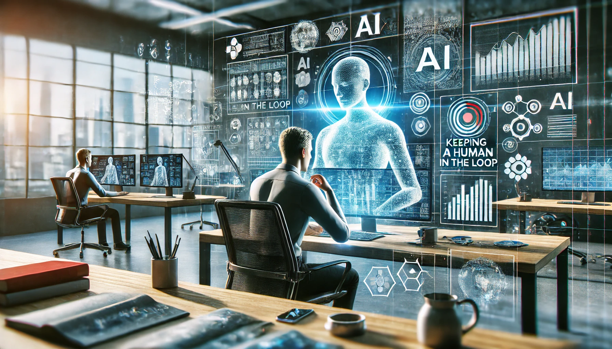

---
categories:
- technology
- workplace
contributors:
- Scot Campbell
date: 2024-08-05 00:00:00+00:00
description: Explore how to effectively integrate AI tools in the workplace, balancing
  efficiency with human skills and ethical considerations.
draft: false
homepage: false
lastmod: 2024-08-05 00:00:00+00:00
pinned: false
seo:
  canonical: https://sr4001.net.//blog/navigating-ai-tools-daily-work/
  description: Explore how to effectively integrate AI tools in the workplace, balancing
    efficiency with human skills and ethical considerations.
  noindex: false
  title: Navigating the Use of AI Tools in Daily Work
summary: Explore how to effectively integrate AI tools in the workplace, balancing
  efficiency with human skills and ethical considerations.
tags:
- AI
- productivity
- work ethics
- digital transformation
title: Navigating the Use of AI Tools in Daily Work
weight: 50
---

Imagine walking into your office to find a new colleague at the desk next to yours. This coworker never sleeps, can process vast amounts of information in seconds, and seems to have an answer for everything. Sounds like a dream team member, right? But what if this tireless worker also lacks the ability to read between the lines, misses cultural nuances, and can't brainstorm truly novel ideas?

<!--more-->

Welcome to the world of [AI in the workplace](https://hbr.org/2019/07/how-ai-is-changing-work-and-leadership) - a realm where incredible efficiency meets potential pitfalls, and where navigating the balance between human insight and artificial intelligence has become a critical skill.

As [AI tools](https://www.gartner.com/en/information-technology/glossary/artificial-intelligence) become increasingly embedded in our daily work lives, they bring both exciting opportunities and complex challenges. This post explores the nuanced landscape of AI in the workplace, offering insights on how to harness its power while avoiding common pitfalls.

## The AI as a Junior Coworker: A Useful Analogy

To better understand the role of AI in our work lives, it's helpful to think of AI tools as a junior coworker. This hypothetical colleague is exceptionally good at research, data compilation, and generating ideas based on existing information. They're quick, efficient, and can process vast amounts of data. However, like any junior team member, they lack the experience and nuanced understanding that comes with years in the field. They may miss contextual cues, struggle with creative problem-solving, and need guidance on complex issues.

With this analogy in mind, let's explore how we can best utilize AI tools while avoiding common pitfalls.

## The Appeal and Potential Pitfalls of AI in the Workplace

AI tools are attractive for their ability to save time, provide quick access to information, and generate content rapidly. For businesses, this translates to increased efficiency and potential cost savings. However, the convenience of AI comes with its own set of challenges:

**Over-Reliance on AI for Decision-Making**: While AI can process data and provide recommendations, it lacks the ability to understand context and nuances. Critical decisions should always involve human judgment. For example, an AI system might recommend cutting a product line based purely on recent sales data, without considering its strategic importance in attracting customers who then purchase higher-margin items. A human manager would recognize the product's role in the broader business strategy and make a more informed decision.

**Misinterpretation of AI Outputs**: AI tools often present findings in an authoritative manner, but their accuracy depends on the quality of their [training data](https://ai.googleblog.com/2018/12/an-introduction-to-ai-data-training.html) and algorithms. It's essential to critically evaluate AI-generated information. Consider an AI-driven market analysis that misses emerging trends because its training data doesn't include the most recent market shifts or niche consumer behaviors. A human analyst might catch these oversights by staying attuned to industry news and consumer sentiment on social media.

**Potential Erosion of Critical Thinking Skills**: Excessive dependence on AI for tasks requiring analysis and judgment may lead to a decline in employees' [critical thinking abilities](https://www.aacu.org/aacu-news/newsletter/2019/november/facts-figures). For instance, marketing teams relying heavily on AI-generated campaign ideas might lose their ability to craft unique, brand-specific strategies that resonate on a deeper level with their audience. Over time, this could result in less innovative and less effective marketing campaigns.

**Lack of Emotional Intelligence**: AI cannot truly comprehend or respond to human emotions, which is crucial in many aspects of business, such as customer service and team management. An [AI chatbot](https://www.ibm.com/cloud/learn/chatbot) might fail to recognize the underlying frustration in a customer's politely worded complaint, missing an opportunity to provide empathetic support. A human customer service representative, on the other hand, would pick up on subtle cues and address the customer's emotional needs as well as their practical concerns.

**Data Privacy Concerns**: AI systems often require access to large amounts of data, potentially raising privacy and security issues if not properly managed. An AI tool used for employee performance analysis might inadvertently expose sensitive personal information if not properly configured. This could lead to legal issues and damage employee trust in the organization.

**Difficulty in Explaining AI Outputs**: The complexity of AI algorithms can make it challenging for users to understand and explain how certain conclusions were reached. When asked to justify an AI-recommended investment strategy to stakeholders, a financial analyst might struggle to articulate the underlying reasoning, potentially eroding trust in the decision-making process. This lack of transparency can be particularly problematic in regulated industries where decision-making processes need to be clearly documented and justified.

## Strategies for Effective AI Integration

To harness the benefits of AI while mitigating its risks, consider the following approaches:

**Maintain Human Oversight**: Always keep a human in the loop, especially for critical decisions. Think of AI as providing a first draft or initial analysis that needs human review and refinement. Implement a process where AI-generated reports or recommendations are reviewed by experienced team members before being acted upon. This ensures that AI insights are contextualized within broader business goals and human expertise.

**Develop Critical Thinking Skills**: Encourage your team to think critically about AI outputs. Foster a culture of curiosity and constructive skepticism. Organize regular workshops where team members analyze and discuss AI-generated outputs, identifying potential biases or oversights. This not only improves the quality of AI-assisted work but also sharpens employees' analytical skills.

**Implement Strong Data Privacy Measures**: Ensure that AI systems are secure and have access only to necessary data. Regularly review and update data privacy policies. Conduct regular audits of AI tool data access and usage, and implement strict [data anonymization](https://dataprivacylab.org/projects/identifiability/paper1.pdf) protocols where possible. This protects sensitive information and builds trust with employees and customers.

**Invest in AI Literacy**: Prioritize education about AI within your organization. This includes understanding both the capabilities and limitations of AI tools. Develop an AI training program for employees at all levels, covering basic [AI concepts](https://machinelearningmastery.com/what-is-artificial-intelligence/), tool-specific training, and ethical considerations. This empowers employees to use AI tools effectively and responsibly.

**Regularly Review AI Systems**: Periodically assess your AI tools to ensure they're performing as expected and adjust as needed. Set up quarterly reviews of AI system performance, involving both technical teams and end-users to gather comprehensive feedback. This helps identify areas for improvement and ensures that AI tools continue to meet evolving business needs.

**Foster Collaboration**: Encourage dialogue between AI experts and other employees to bridge the gap between technical and non-technical teams. Create cross-functional teams for AI-related projects, ensuring a mix of technical experts and domain specialists. This collaboration leads to more effective AI integration and helps non-technical staff better understand and trust AI outputs.

## The Importance of Comprehending AI Outputs

Understanding and being able to explain AI outputs is crucial. Here are some tips to enhance your comprehension:

1. **Educate Yourself on AI Basics**: Gain a foundational understanding of how AI and [machine learning](https://www.experian.com/blogs/news/2021/06/machine-learning-101/) work. Enroll in online courses or attend workshops on AI fundamentals to build this knowledge base.

2. **Analyze the Data**: Familiarize yourself with the data sources and processing methods used by your AI tools. Request documentation from your AI tool providers about their data sources and methodologies to understand the context of AI outputs.

3. **Question the Outputs**: Always ask "why" and "how" when reviewing AI-generated recommendations or analyses. Develop a standard set of questions to ask about any AI output, such as "What data was this based on?" and "What assumptions were made?"

4. **Practice Clear Communication**: When explaining AI outputs to others, focus on key insights and their practical implications rather than technical details. Create templates for presenting AI-generated insights that emphasize business impact and actionable takeaways.

## Balancing AI and Human Skills in Specific Work Scenarios

Let's explore how the interplay between AI tools and human skills can be optimized in various workplace scenarios:

**Strategic Planning**: AI can contribute by rapidly analyzing market trends, competitor activities, and internal performance data. However, the human element is crucial in interpreting this data in the context of company vision, values, and long-term goals. A balanced approach involves using AI to generate initial strategic options, but relying on human judgment for final decision-making, considering factors like company culture and ethical implications.

**Customer Service**: AI excels at handling routine inquiries and providing quick responses to common questions. The human touch becomes essential when managing complex issues, providing empathy, and maintaining brand voice in delicate situations. Implement AI chatbots for front-line customer interactions, with clear escalation pathways to human representatives for nuanced or sensitive issues.

**Product Development**: AI can analyze user feedback, predict market demand, and optimize product features based on data. Human creativity and intuition are irreplaceable for innovative leaps and final design decisions. Use AI to inform the product development process with data-driven insights, but rely on human creativity and intuition for innovative leaps and final design decisions.

**Financial Analysis**: AI processes large volumes of financial data, identifies patterns and anomalies, and generates routine reports efficiently. Human analysts are crucial for interpreting financial trends in the context of broader economic conditions, regulatory changes, and strategic objectives. Leverage AI for data processing and initial analysis, but have experienced financial analysts review and contextualize the findings before making significant financial decisions.

## Ethical Considerations in AI Integration

As we integrate AI more deeply into our work processes, it's crucial to consider the [ethical implications](https://www.brookings.edu/research/ten-principles-for-ethics-in-artificial-intelligence/):

**Transparency**: Ensure that the use of AI in decision-making processes is clearly communicated to all stakeholders. This builds trust and allows for informed discussions about AI's role in the organization.

**Fairness**: Regularly audit AI systems for bias and ensure they're not perpetuating or exacerbating existing inequalities. This is particularly important in areas like hiring, performance evaluations, and customer service.

**Accountability**: Establish clear lines of responsibility for AI-assisted decisions and their outcomes. This ensures that there's always a human responsible for the consequences of AI-driven actions.

**Privacy**: Implement robust [data protection](https://www.eugdpr.org/) measures and be transparent about how employee and customer data is used in AI systems. This protects individuals' rights and helps maintain trust in the organization.

**Job Displacement**: Consider the potential impact of AI integration on workforce dynamics and develop strategies to reskill and redeploy employees as needed. This helps manage the transition to AI-augmented work environments in a socially responsible manner.

## Conclusion: AI as a Tool, Not a Replacement

AI has the potential to significantly enhance workplace productivity, but it's essential to remember that it's a tool to augment human intelligence, not replace it. By being aware of AI's limitations and taking steps to use it judiciously, we can leverage its power while maintaining the critical thinking and decision-making skills that are vital in today's complex work environment.

Ultimately, successful AI integration lies in striking a balance between utilizing AI capabilities and applying human wisdom and creativity. By maintaining this equilibrium, AI can serve as a valuable assistant in your work, enhancing your capabilities without undermining your unique human strengths.

As we continue to navigate this new landscape of AI-augmented work, it's crucial to remain adaptable, curious, and critically engaged. The most successful individuals and organizations will be those who can harness the power of AI while nurturing the irreplaceable human qualities of creativity, empathy, and strategic thinking. In doing so, we can create work environments that are not only more efficient but also more innovative, ethical, and fulfilling.

## More on Simpleminded Robot

If you found this article interesting, you might also enjoy these related posts:

- [Enhancing Cybersecurity with AI](): Explores how AI can be used to bolster cybersecurity measures, complementing the discussion on AI integration in various workplace scenarios.

- [Analyzing Media with Custom GPT](): Demonstrates a practical application of AI in media analysis, providing insights into how AI tools can be leveraged for specific tasks.

- [Harnessing AI to Tame the Knowledge Chaos in Agile Teams](): Discusses the use of AI in managing information and knowledge within agile teams, offering another perspective on AI integration in workplace processes.

- [Critically Evaluating Generated Content](): Addresses the importance of critically assessing AI-generated content, which is directly relevant to the challenges of using AI in daily work.

These articles delve into critical aspects of AI integration, such as cybersecurity considerations, practical applications in media analysis, knowledge management in agile environments, the importance of critical evaluation of AI-generated content, and the broader impact of AI on workplace culture. By exploring these interconnected topics, readers can gain a holistic understanding of how AI is transforming work practices across different domains and the key considerations for effectively leveraging AI tools while maintaining human expertise and ethical standards.