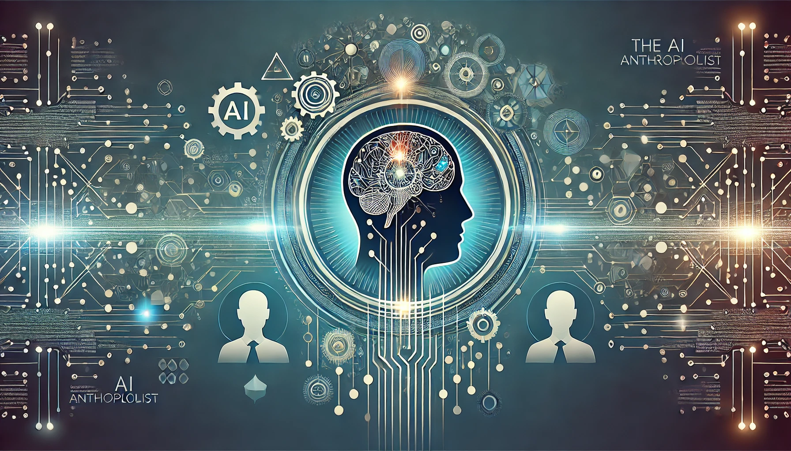

---
categories:
  - technology
  - artificial intelligence
contributors:
  - Scot Campbell
date: 2024-09-11 00:00:00+00:00
description: Explore the ethical considerations surrounding the AI Anthropologist,
  focusing on privacy, consent, transparency, and responsible implementation in the
  workplace.
draft: false
homepage: false
lastmod: 2024-09-11 00:00:00+00:00
pinned: false
seo:
  canonical: https://sr4001.net.//blog/navigating-the-ethical-landscape-of-the-ai-anthropologist/
  description: Explore the ethical considerations surrounding the AI Anthropologist,
    focusing on privacy, consent, transparency, and responsible implementation in
    the workplace.
  noindex: false
  title: "The AI Anthropologist 3: Navigating the Ethical Landscape"
series:
  - The AI Anthropologist
summary: Explore the ethical considerations surrounding the AI Anthropologist, focusing
  on privacy, consent, transparency, and responsible implementation in the workplace.
tags:
  - AI anthropologist
  - ethics
  - privacy
  - consent
  - transparency
  - workplace AI
title: "The AI Anthropologist 3: Navigating the Ethical Landscape"
weight: 50
---

In the first two posts of this series, we explored the concept of the AI Anthropologist and the technologies that make it possible. By leveraging Natural Language Processing (NLP), emotion recognition, machine learning, and Organizational Network Analysis (ONA), organizations can gain a deeper understanding of the complex social and emotional dynamics at play in their workplace. The AI Anthropologist offers a powerful set of tools to observe, analyze, and provide insights into these dynamics. However, as with any powerful technology, its implementation raises significant ethical concerns.

<!--more-->

This third post delves into the ethical landscape surrounding the AI Anthropologist, focusing on privacy, consent, transparency, and the balance between insightful observation and invasive surveillance. We'll also look at how organizations can design and deploy these AI systems thoughtfully and responsibly. As we continue to draw on the references from the previous posts, it becomes clear that ethical considerations should be at the forefront of AI implementation in the workplace.

### The Dual-edged Sword of AI in the Workplace

AI's role in enhancing workplace dynamics presents a unique paradox. On one hand, AI technologies like the AI Anthropologist promise to improve employee experience, foster collaboration, and enhance productivity. On the other hand, these technologies also come dangerously close to infringing on personal privacy and creating a surveillance-driven workplace. This tension between **improvement and intrusion** is at the core of the ethical dilemma.

AI systems that analyze internal communications, emotions during video meetings, and social networks within an organization can easily be perceived as invasive if not handled with the utmost care. The **difference between empowering employees** through data-driven insights and **monitoring them to control or penalize** their actions often lies in how the system is implemented and communicated.

### Transparency: The Foundation of Trust

The first principle of ethically deploying the AI Anthropologist is **transparency**. Employees must know, in clear terms, what the AI is doing, why it's being used, and how it will benefit them. Without this understanding, any AI system can quickly erode trust and foster a culture of suspicion.

Transparency can be achieved in several ways:

1. **Clear Communication**: Regular updates, workshops, and Q&A sessions that explain the AI's role in the workplace are crucial. Leaders should communicate that the goal is to improve workplace culture and provide proactive support, not to monitor every interaction or behavior. For more on the importance of transparency in AI, see this [article by the World Economic Forum](https://www.weforum.org/agenda/2024/01/generative-ai-genai-best-practices-transparency/).
2. **Access to Insights**: Employees should have visibility into the types of insights being generated from the AI. Whether the AI is tracking sentiment trends, collaboration patterns, or other metrics, providing access to aggregate-level data (while ensuring privacy) can demystify the AI's role and build trust.
3. **Open Feedback Channels**: A transparent AI system also listens. Establishing open feedback channels allows employees to voice concerns about how the AI is functioning and propose adjustments that would make them feel more comfortable.

For instance, when implementing tools like [Natural Language Processing](https://www.ibm.com/topics/natural-language-processing) to analyze workplace communication, it's vital that employees are aware of what's being tracked and what the AI does not access (e.g., personal messages, sensitive content). Similarly, if an AI system uses emotion recognition during video meetings, employees should know the purpose (to track general team sentiment) and be given the option to opt out if they're uncomfortable with the idea.

### Privacy by Design

Perhaps the most significant ethical concern regarding the AI Anthropologist is the issue of **privacy**. Workplace AI, by its very nature, handles vast amounts of data, much of which can be personal, sensitive, or contextually significant. It's essential to design AI systems with **privacy-first principles** to ensure that employee rights are respected.

#### Anonymization and Aggregation

The AI Anthropologist should primarily operate at an **aggregate level**, analyzing overall team dynamics and trends rather than focusing on individual behavior. Anonymizing data as much as possible—particularly in areas like emotion recognition and communication analysis—ensures that employees are not singled out based on their emotional state or specific interactions.

For example, in [Organizational Network Analysis](https://visiblenetworklabs.com/2024/03/19/how-to-conduct-an-organizational-network-analysis/), anonymizing the participants involved in informal network structures can allow organizations to see which roles or teams are central to information flow without identifying specific employees. Aggregated data gives leaders the insights they need while minimizing the risk of privacy violations.

#### Limiting Data Access

Privacy concerns can also be mitigated by limiting the type and amount of data the AI Anthropologist can access. For example, **emotion recognition** tools should be designed to focus only on relevant interactions, like meetings, rather than constant surveillance of employee behavior. Moreover, these systems should be deployed only where there's clear organizational value and with employee consent.

By limiting the data scope and processing only what's necessary, the AI Anthropologist can achieve its goals without overstepping ethical boundaries. This approach aligns with the principles of **data minimization** under regulations like the **General Data Protection Regulation (GDPR)** in Europe, which mandates that companies only collect data necessary for specific purposes. For more on data privacy principles, see [this GDPR guide](https://gdpr-info.eu/).

#### Employee Control Over Data

Organizations should also consider implementing policies that give employees more **control over their data**. For example, allowing employees to **opt out** of certain types of data analysis (e.g., emotion recognition during meetings) ensures that participation is voluntary. Moreover, providing employees with access to their data and the ability to request its deletion reinforces the notion that the AI system is there to serve employees, not to exploit them.

### Consent and Participation

The issue of **consent** is closely tied to privacy. When employees are aware of and agree to the implementation of AI systems like the AI Anthropologist, they are more likely to trust the system and view it as beneficial rather than intrusive. Consent, however, should not be limited to a checkbox on a policy document; it should be an ongoing process of dialogue and involvement.

#### Informed Consent

Employees should give **informed consent**, meaning they understand what data is being collected, how it will be used, and the benefits and potential risks involved. This requires clear, accessible communication—technical jargon should be avoided so that all employees, regardless of their role or background, can make informed decisions about their participation.

Organizations can also ensure that employees can **revoke consent** at any time without repercussions. This flexibility respects employees' autonomy and reinforces trust. Ethical AI use in the workplace can draw from principles like those outlined in [IBM's ethical guidelines for AI](https://www.ibm.com/watson/ai-ethics/), which emphasize informed consent as a foundational principle.

### The Fine Line: Surveillance vs. Insight

One of the most challenging ethical dilemmas posed by the AI Anthropologist is distinguishing between **insightful observation** and **surveillance**. AI systems, especially those designed to analyze workplace dynamics, walk a fine line between providing valuable insights and crossing over into invasive monitoring.

The key to maintaining the right balance is ensuring that the AI Anthropologist operates **proactively** rather than **reactively**. Its purpose should be to identify opportunities for improving collaboration, well-being, and culture—not to police individual behaviors or to generate punitive actions.

#### Monitoring vs. Empowerment

For example, using [sentiment analysis](https://www.ibm.com/topics/sentiment-analysis?mhsrc=ibmsearch_a&mhq=sentiment%20analysis) to identify stress trends in teams can help managers offer support and resources before burnout sets in. However, using the same technology to monitor individual employees' emotional states in real-time would likely feel intrusive and unnecessary.

The same is true for technologies like [machine learning](https://www.ibm.com/topics/machine-learning) that predict potential issues such as team burnout. These tools should provide insights to managers on how to support their teams, not act as surveillance systems that penalize individuals for expressing frustration or stress.

The goal of AI in the workplace should always be to **empower employees**—helping them navigate their work more effectively and providing leaders with the information they need to foster a supportive environment.

### Ethical Guidelines for Implementation

To implement the AI Anthropologist ethically, organizations should establish **guidelines** that govern how the technology is used. These guidelines should include principles like **transparency, consent, data minimization, and employee control over data**.

Additionally, organizations can create **ethics committees** to oversee the AI's implementation and ensure that its use remains aligned with organizational values and ethical principles. These committees can act as checks on the system, ensuring that new use cases are evaluated before they are implemented. Ethical AI guidelines like those outlined by [Google](https://ai.google/responsibilities/responsible-ai-practices/) offer a solid framework for such an approach.

Finally, regular **ethical audits** of the AI system can ensure that it is functioning as intended and that employees feel comfortable with its role in the workplace.

### Case Studies: Successful Ethical Implementations

Several organizations have successfully implemented similar AI-driven systems while maintaining an ethical balance. Companies like Microsoft, which has integrated [Workplace Analytics](https://www.microsoft.com/en-us/microsoft-viva/insights) into their collaboration tools, have adopted privacy-first approaches to analyze team dynamics. They focus on aggregate data, ensuring that personal insights are never used punitively but instead to provide teams with insights into their collaborative efforts and work-life balance.

Another example is Google, which has embraced ethical AI guidelines and formed advisory boards to ensure that its AI systems, such as those used in internal operations, follow the company's broader ethical principles. By engaging in regular dialogue with employees and stakeholders, Google has maintained transparency around how AI is applied within the company.

### Conclusion

The potential of the AI Anthropologist to revolutionize workplace culture and dynamics is clear. However, to realize that potential, organizations must be prepared to navigate the complex ethical landscape that accompanies this technology. By prioritizing **transparency, privacy, consent, and trust**, the AI Anthropologist can provide the insights needed to foster a healthier, more productive workplace without crossing into surveillance.

As we move forward into the final post of this series, we'll provide a practical, step-by-step guide for implementing the AI Anthropologist in your organization—highlighting best practices, staged roll outs, and the metrics to measure success while keeping ethical considerations at the forefront.

---

### **Next in the Series: Implementing the AI Anthropologist: A Step-by-Step Guide**

In the final post of this series, we'll provide a detailed roadmap for implementing the AI Anthropologist in your organization. From gaining buy-in from stakeholders to rolling out the AI in stages, we'll cover everything you need to know to ensure a smooth and ethical integration. We'll also explore how to measure the success of the AI Anthropologist and continuously iterate on its implementation to improve workplace dynamics. Stay tuned!

### More on Simpleminded Robot

- [Writing User Stories with AI: Part 1](): This post explores the intersection of AI and user stories, providing a foundation for how AI can be used to streamline and enhance workflows in the workplace—similar to the goals of the AI Anthropologist in uncovering workplace dynamics.

- [Enhancing Cybersecurity with AI](): Although focused on cybersecurity, this post highlights the broader role AI plays in safeguarding workplace environments. It connects to the ethical considerations of AI in ensuring workplace safety and privacy.

- [Writing User Stories with AI: Part 2](): This second post in the user stories series delves deeper into using AI for business process optimization. The parallels to the AI Anthropologist are clear—both involve using AI to gain insights and optimize how teams and processes function within organizations.
