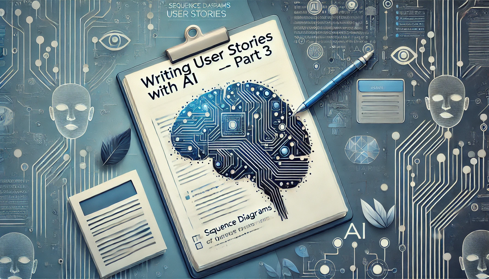
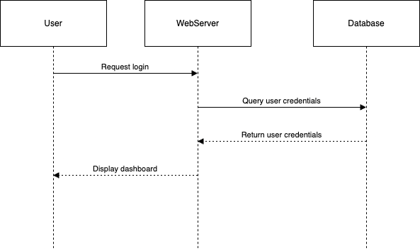

---
categories:
  - agile development
  - AI
contributors:
  - Scot Campbell
date: 2024-07-11 00:00:00+00:00
description: Explore how Gherkin, sequence diagrams, and Mermaid notation enhance
  functional requirements clarity and streamline testing in AI-assisted user story
  writing.
draft: false
homepage: false
lastmod: 2024-07-11 00:00:00+00:00
pinned: false
seo:
  canonical: https://sr4001.net.//blog/writing-user-stories-with-ai-3/
  description: Explore how Gherkin, sequence diagrams, and Mermaid notation enhance
    functional requirements clarity and streamline testing in AI-assisted user story
    writing.
  noindex: false
  title: "Writing User Stories With AI 3: Beyond User Stories"
series:
  - Writing User Stories With AI
summary: Explore how Gherkin, sequence diagrams, and Mermaid notation enhance functional
  requirements clarity and streamline testing in AI-assisted user story writing.
tags:
  - agile
  - AI
  - gherkin
  - mermaid
  - sequence diagrams
  - software development
  - software testing
  - user stories
title: "Writing User Stories With AI 3: Beyond User Stories"
weight: 50
---

As we continue to integrate AI into the process of software development, it's essential to look beyond just writing user stories. While user stories are fundamental in defining the "what" of a project, there are tools and techniques that can greatly enhance our understanding of the "how." This post will explore how [Gherkin](<https://en.wikipedia.org/wiki/Cucumber_(software)#Gherkin_language>), sequence diagrams, and [Mermaid notation](<https://en.wikipedia.org/wiki/Mermaid_(software)>) can be used in conjunction with AI to bring greater clarity to functional requirements and streamline the process of automated testing. By leveraging these tools, we can create a more comprehensive and actionable set of specifications that bridge the gap between high-level user stories and detailed technical implementations. This approach not only enhances communication between stakeholders but also paves the way for more efficient development and testing processes.

<!--more-->



## Recap: The Foundation of AI-Generated User Stories

In the [first post]() of this series, we focused on preparing AI to write user stories effectively. The preparation phase is critical—it involves providing context, defining the project scope, and aligning on key terms. By setting up the AI with the right inputs, we can ensure that the output aligns with our expectations and accurately reflects the project requirements.

In the [second post](), we took a deeper dive into the mechanics of drafting user stories using AI. We discussed how AI can be used to generate initial drafts based on business requirements documents (BRDs) and how to iteratively refine these drafts. The goal was to create user stories that are clear, concise, and actionable, ensuring they align with the broader project objectives and meet the needs of all stakeholders.

While these first two posts laid a solid foundation for using AI to write user stories, it's now time to explore how we can go beyond user stories to ensure that the functional requirements are fully understood and can be effectively tested.

## Introducing Gherkin, Sequence Diagrams, and Mermaid Notation

### Gherkin: Bridging the Gap Between Human and Machine

[Gherkin](<https://en.wikipedia.org/wiki/Cucumber_(software)#Gherkin_language>) is a plain-text language that serves as the cornerstone of [Behavior-Driven Development (BDD)](https://en.wikipedia.org/wiki/Behavior-driven_development). It allows us to define test cases in a way that both non-technical stakeholders and automated testing tools can understand. The beauty of Gherkin lies in its simplicity and structure—every scenario is written in a way that describes the behavior of the system in business terms.

For example, consider a simple scenario for user login:

```gherkin
Feature: User login
  Scenario: Successful login with valid credentials
    Given the user is on the login page
    When the user enters valid credentials
    Then the user should be redirected to the dashboard
```

This scenario is straightforward and maps directly to the user's expected behavior. By using Gherkin, we ensure that the behavior is clearly documented and can be easily converted into automated tests, bridging the gap between human understanding and machine execution.

### Sequence Diagrams: Visualizing Interactions

[Sequence diagrams](https://en.wikipedia.org/wiki/Sequence_diagram) are a powerful tool for visualizing how objects or components within a system interact with each other over time. They provide a clear, linear view of the flow of data and control among different parts of the system, making it easier to understand complex processes and identify potential issues or areas of improvement.

A sequence diagram typically involves participants (which could be users, systems, or components) and messages passed between them. The flow of these messages over time is what helps us understand how different parts of a system collaborate to fulfill a given requirement.

### Mermaid Notation: A Modern Tool for Diagramming

[Mermaid](<https://en.wikipedia.org/wiki/Mermaid_(software)>) is a JavaScript-based tool that allows users to create diagrams and visualizations from text descriptions. It's a modern, lightweight tool that has gained popularity due to its simplicity and versatility. Mermaid supports a variety of diagram types, including sequence diagrams, flowcharts, and Gantt charts, making it an excellent choice for developers and analysts who need to quickly visualize workflows without relying on complex diagramming software.

## Using AI to Generate Gherkin and Mermaid Diagrams

Now that we have a foundational understanding of Gherkin, sequence diagrams, and Mermaid notation, let's explore how AI can assist in generating these artifacts based on a set of requirements.

### AI-Generated Gherkin Scenarios

Given a set of functional requirements, AI can generate Gherkin scenarios that are ready for review and refinement. This not only saves time but also ensures that the scenarios are comprehensive and aligned with the expected behavior of the system. For instance, let's consider a requirement for managing a shopping cart:

```gherkin
Feature: Shopping cart management
  Scenario: Add item to cart
    Given the user has selected an item to purchase
    When the user clicks on the "Add to cart" button
    Then the item should be added to the shopping cart
    And the cart should update the total price
```

This scenario is a clear representation of what the system should do when a user adds an item to their cart. The Gherkin syntax ensures that this behavior is documented in a way that can be easily translated into automated tests, allowing for seamless validation of the feature's functionality.

### AI-Generated Mermaid Sequence Diagrams

AI can also be used to generate Mermaid sequence diagrams, which can be invaluable for visualizing complex interactions within a system. Here's an example of a simple sequence diagram generated by AI:

```js
sequenceDiagram
  participant User
  participant WebServer
  participant Database

  User->>WebServer: Request login
  WebServer->>Database: Query user credentials
  Database-->>WebServer: Return user credentials
  WebServer-->>User: Display dashboard
```

This diagram illustrates the flow of actions during a user login process. By having the AI generate the sequence diagram in Mermaid notation, we can easily visualize the interactions between different components of the system. These diagrams are especially useful for identifying potential bottlenecks or points of failure in the process, enabling teams to address issues early in the development cycle.

By having the AI output the diagram in Mermaid notation, you can then use a tool like [Draw.io](https://draw.io) to render the diagram as an image.



Mermaid notation is text-based, which means it can be easily generated by AI. This allows for precise control over the output and makes it easy to update diagrams as requirements evolve. Further, by using source control, we can ensure that the diagrams are versioned and tracked, making it easy to revert to a previous version if necessary.

## Practical Applications: Enhancing Clarity and Facilitating Testing

The combination of AI-generated Gherkin scenarios and Mermaid sequence diagrams offers several practical benefits:

1. **Enhanced Clarity**: By documenting both the expected behavior (through Gherkin) and the interactions between system components (through Mermaid), we ensure that all stakeholders have a clear understanding of how the system should function. This clarity reduces the likelihood of misunderstandings and helps keep the project on track.

2. **Streamlined Testing**: Gherkin scenarios can be directly translated into automated tests, allowing teams to quickly validate that the system behaves as expected. The sequence diagrams provide a visual reference that can be used to ensure that all interactions are correctly implemented, further enhancing the testing process.

3. **Improved Collaboration**: These tools bridge the gap between technical and non-technical team members. Gherkin scenarios use business language that is accessible to all stakeholders, while Mermaid diagrams provide a visual representation that can be easily understood by those who may not be familiar with the underlying code or architecture.

## Conclusion

As we continue to explore the integration of AI into various stages of software development, the use of tools like Gherkin, sequence diagrams, and Mermaid notation will become increasingly valuable. By leveraging AI to generate these artifacts, we can enhance the clarity of functional requirements, streamline the process of automated testing, and improve overall collaboration within the team.

These tools not only help us write better user stories but also ensure that the stories are translated into a functional, testable system. As we move forward, the possibilities for using AI to revolutionize software design and testing are vast, and we're just beginning to scratch the surface.

Stay tuned for more insights into how AI can transform the way we approach software development, from ideation to deployment.
